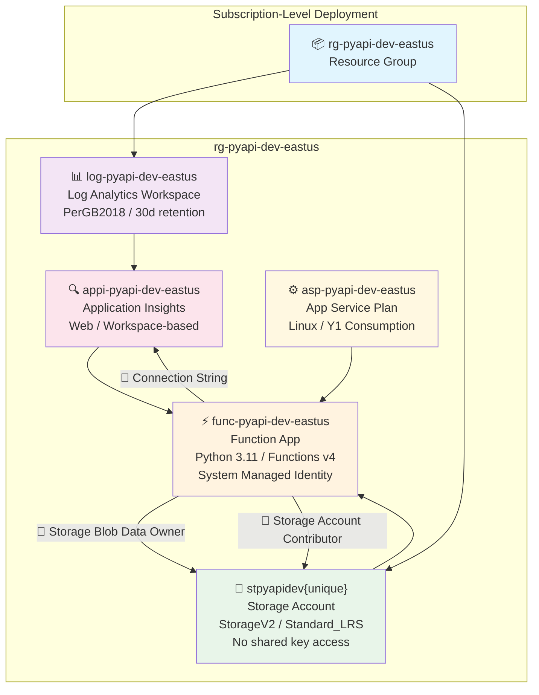

# Architecture: Python Function App (`deploy-20260512-082853`)

## Resource Topology

## Resource Inventory

| # | Resource | Type | SKU | Region |
|---|----------|------|-----|--------|
| 1 | `rg-pyapi-dev-eastus` | Resource Group | — | East US |
| 2 | `log-pyapi-dev-eastus` | Log Analytics Workspace | PerGB2018 | East US |
| 3 | `appi-pyapi-dev-eastus` | Application Insights | Workspace-based | East US |
| 4 | `stpyapidev{unique}` | Storage Account | Standard_LRS | East US |
| 5 | `asp-pyapi-dev-eastus` | App Service Plan | Y1 (Consumption) | East US |
| 6 | `func-pyapi-dev-eastus` | Function App | Python 3.11 / v4 | East US |

## Data Flow

1. **HTTP requests** → Function App (HTTPS-only, TLS 1.2+)
2. **Function App** → Storage Account (identity-based, RBAC — no connection strings)
3. **Function App** → App Insights (telemetry via connection string)
4. **App Insights** → Log Analytics (workspace-linked)
