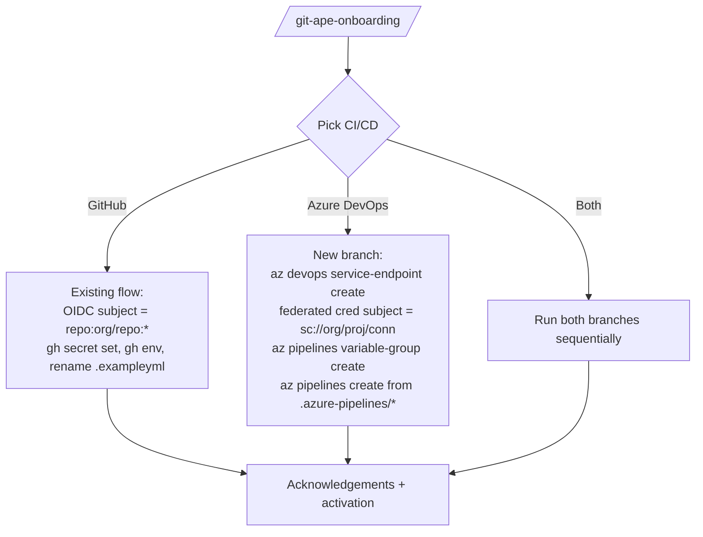

<!-- markdownlint-disable-file -->
# Task Research: Add Azure DevOps as a CI/CD Option in Onboarding Agent

Investigate what would be required to extend the Git-Ape onboarding agent and skill so a user can pick **Azure DevOps Pipelines** as an alternative (or additional) CI/CD platform alongside the current GitHub Actions implementation. No code changes — research only.

## Task Implementation Requests

* Map every concept the current onboarding agent configures for GitHub (OIDC, RBAC, env, secrets, workflow activation) to its Azure DevOps equivalent.
* Identify all artifacts that need to change (agent file, skill file, workflow files, copilot-instructions, docs).
* Surface gaps where ADO has no clean equivalent of a GitHub feature the workflows rely on.
* Recommend a single preferred approach to add ADO support.

## Scope and Success Criteria

* Scope: onboarding flow, deploy/plan/destroy/verify pipelines, OIDC/auth model, secrets, environments, PR-comment integrations.
* Out of scope: changing the ARM templates, agents downstream of onboarding (`azure-resource-deployer`, etc.), or non-CI features (drift, cost, etc.).
* Assumptions:
  * "Azure DevOps" means Azure Pipelines + Repos + Service Connections (cloud, `dev.azure.com`).
  * The user keeps the repo on GitHub OR migrates to Azure Repos — both must be supported.
  * Workload identity federation (OIDC) is the target auth model, matching the existing security posture (no client secrets).
* Success Criteria:
  * Document covers what changes in `git-ape-onboarding.agent.md` and `git-ape-onboarding/SKILL.md`.
  * Document lists ADO equivalents for every GitHub primitive currently used by the four workflows.
  * Document calls out 3+ concrete gaps with mitigations.
  * Document ends with one selected approach and reasoning.

## Outline

1. Current state of GitHub-only onboarding — primitives in use.
2. Azure DevOps equivalents (auth, secrets, environments, pipelines, PR comments).
3. Gaps and friction points.
4. Files that need changes.
5. Selected approach + alternatives.

## Research Executed

### File Analysis

* `.github/agents/git-ape-onboarding.agent.md`
  * 12-step workflow tightly bound to GitHub: confirms repo URL, validates `gh auth status`, runs OIDC setup against GitHub orgs, asks the three production-safety acknowledgements, then renames `.exampleyml` → `.yml` files.
  * Step 7 specifically detects GitHub org's OIDC subject template (`gh api orgs/<org>/actions/oidc/customization/sub --jq '.use_default'`). No equivalent step exists for ADO.
  * Validation block runs `gh auth status` and `az ad app federated-credential list` filtered by federated subjects of the form `repo:<org>/<repo>:...` or `repository_owner_id:...`.

* `.github/skills/git-ape-onboarding/SKILL.md`
  * "What It Configures" lists 5 things, all GitHub-shaped:
    1. Entra App + SP (CI/CD-agnostic — reusable)
    2. OIDC federated credentials *for GitHub Actions* (issuer = `token.actions.githubusercontent.com`)
    3. RBAC role assignment (CI/CD-agnostic)
    4. GitHub environments (`azure-deploy*`, `azure-destroy`)
    5. GitHub secrets `AZURE_CLIENT_ID`, `AZURE_TENANT_ID`, `AZURE_SUBSCRIPTION_ID`
  * Command playbook step 4 builds `OIDC_PREFIX` exclusively for GitHub (`repo:<org>/<repo>` or `repository_owner_id:...`).
  * Step 5 creates federated credentials for `main`, `pull_request`, `azure-deploy*`, `azure-destroy` — all GitHub-claim-based.
  * Step 11 (workflow activation) renames four `.exampleyml` files in `.github/workflows/`. ADO would need parallel `.azure-pipelines/` content.

* `.github/workflows/git-ape-plan.exampleyml`
  * Uses: `actions/checkout@v6`, `actions/upload-artifact@v7`, `actions/download-artifact@v8`, `actions/github-script@v8`, GitHub matrix strategy, `github.rest.issues.createComment` / `updateComment` to post the plan as a PR comment, GitHub OIDC via `azure/login@v2`.
  * SARIF upload via `codeql-action/upload-sarif` (GitHub-only — Advanced Security).
  * Triggers: `pull_request` opened/synchronize on path filter.

* `.github/workflows/git-ape-deploy.exampleyml`
  * Two triggers: `push` to `main` on path filter, AND `issue_comment` `/deploy`.
  * Uses `actions/github-script` to gate on PR-approval reviews (`pulls.listReviews`) — purely GitHub API.
  * Writes back state.json via `contents: write` permission and pushes to repo.

* `.github/workflows/git-ape-destroy.exampleyml`, `git-ape-verify.exampleyml`
  * Same shape: GitHub-environment-gated, OIDC, `gh`/github-script for comments.

* `.github/copilot-instructions.md`
  * "Pipeline Mode" section is hard-coded to GitHub Actions (lines 163–270). Auth priority table (line 376) names "GitHub Actions / Copilot Coding Agent" as the top-priority OIDC context.
  * "OIDC Setup for GitHub Actions" section gives a step-by-step that would need a sibling "OIDC Setup for Azure DevOps".

### Code Search Results

* `azure-pipelines|azure devops` across repo
  * Zero pipeline YAML files. Only one passing reference to "Azure DevOps pipeline" in `azure-drift-detector/SKILL.md:292` (cron suggestion). No prior ADO scaffolding exists.

### External Research

* Microsoft Learn — Workload identity federation for Azure Pipelines
  * Issuer: `https://vstoken.dev.azure.com/<org-id>` (NOT `token.actions.githubusercontent.com`).
  * Audience: `api://AzureADTokenExchange` (same as GitHub).
  * Subject: `sc://<org>/<project>/<service-connection-name>` — bound to a service connection, not to branches/environments.
  * Created via `az devops service-endpoint azurerm create --azure-rm-service-principal-id <CLIENT_ID> --azure-rm-tenant-id <TID> --azure-rm-subscription-id <SUB> --azure-rm-subscription-name <NAME> --name <CONN_NAME> --authentication-type workloadIdentityFederation` then `az ad app federated-credential create` for the matching subject.
  * Source: https://learn.microsoft.com/azure/devops/pipelines/library/connect-to-azure (workload-identity section).

* Microsoft Learn — Azure Pipelines triggers
  * `pr:` triggers PR builds (Azure Repos only — for GitHub-hosted repos use ADO's GitHub PR build via app integration).
  * No native `issue_comment` trigger. Closest: PR-level decorators or external webhooks invoking `az pipelines run --branch refs/pull/<id>/merge`.
  * Source: https://learn.microsoft.com/azure/devops/pipelines/yaml-schema/pr.

* Microsoft Learn — Azure Pipelines environments and approvals
  * `environment:` block in YAML maps to ADO Environments, which support approvals/checks per env. Direct equivalent of GitHub environments.
  * Source: https://learn.microsoft.com/azure/devops/pipelines/process/environments.

* Microsoft Learn — Variable groups & secret variables
  * Secrets stored as Library variable groups or pipeline variables (with `isSecret: true`). Reference via `$(AZURE_CLIENT_ID)`. Created by `az pipelines variable-group create`.
  * Source: https://learn.microsoft.com/azure/devops/pipelines/library/variable-groups.

* Microsoft Learn — Posting PR comments from a pipeline
  * Use `System.AccessToken` + REST `POST {org}/{project}/_apis/git/repositories/{repoId}/pullRequests/{prId}/threads?api-version=7.1`.
  * Build identity needs "Contribute to pull requests" on the repo.
  * For GitHub-hosted repo wired to ADO Pipelines: use the GitHub service connection + GitHub REST API (same as Actions, but token differs).
  * Source: https://learn.microsoft.com/rest/api/azure/devops/git/pull-request-threads.

* Microsoft Learn — `az devops` CLI
  * Verbs available: `az devops project create`, `az pipelines create`, `az pipelines variable-group create`, `az repos create`, `az devops service-endpoint azurerm create`, `az pipelines runs ...`.
  * `az devops configure --defaults organization=https://dev.azure.com/<org> project=<proj>`.
  * Source: https://learn.microsoft.com/cli/azure/devops.

### Project Conventions

* `.github/copilot-instructions.md` — Auth Method Priority table; managed identity / OIDC strongly preferred; never use client secrets. ADO support must keep workload identity federation as the default.
* "Security Gate Re-Run Rule" applies regardless of CI provider.
* `.github/instructions/shared/hve-core-location.instructions.md` — agent and skill files use the standard frontmatter (`description`, `name`, `tools`, `user-invocable`).

## Key Discoveries

### Project Structure

The onboarding flow has three layers and CI/CD coupling appears at every layer:

```text
.github/agents/git-ape-onboarding.agent.md     # workflow / acknowledgements / GH-specific validation
.github/skills/git-ape-onboarding/SKILL.md     # CLI playbook (12 steps, GH-shaped)
.github/workflows/git-ape-*.exampleyml         # the actual pipelines being activated
.github/copilot-instructions.md                # "Pipeline Mode (GitHub Actions)" section + OIDC setup
docs/ONBOARDING.md and website/docs/...        # user-facing docs
```

A clean refactor adds a CI provider abstraction at the agent layer, parameterizes the skill, and adds a sibling pipeline tree under `.azure-pipelines/`.

### GitHub vs Azure DevOps Primitive Mapping

| Concern                 | GitHub Actions (current)                                                              | Azure DevOps equivalent                                                                                            |
| ----------------------- | ------------------------------------------------------------------------------------- | ------------------------------------------------------------------------------------------------------------------ |
| Identity                | Entra App + federated cred, issuer `token.actions.githubusercontent.com`              | Same Entra App; new federated cred per **service connection**, issuer `https://vstoken.dev.azure.com/<org-id>`     |
| Subject claim           | `repo:<org>/<repo>:pull_request` / `:ref:refs/heads/main` / `:environment:<env>`      | `sc://<org>/<project>/<service-connection-name>` (one credential per service connection — coarser)                 |
| Audience                | `api://AzureADTokenExchange`                                                          | `api://AzureADTokenExchange` (identical)                                                                           |
| Login task              | `azure/login@v2`                                                                      | `AzureCLI@2` / `AzurePowerShell@5` task with `azureSubscription: <connection-name>`                                |
| Secrets store           | GitHub repo / environment secrets (`gh secret set`)                                   | Library variable group, `az pipelines variable-group create` + variable `isSecret`                                 |
| Environment gating      | GitHub environment `azure-deploy*`, `azure-destroy` with reviewers                    | ADO Environment with Approvals & Checks (`environment:` block)                                                     |
| PR trigger              | `on: pull_request: types: [opened, synchronize]`                                      | `pr:` trigger on path-filtered branches                                                                            |
| Comment trigger         | `on: issue_comment` → gate `/deploy`                                                  | **No native equivalent.** Options: PR-level Approval check, or service-hook → `az pipelines run` from Function App |
| Approval gate           | `pulls.listReviews` via `actions/github-script`                                       | ADO native PR vote / required reviewer; or environment manual approval                                             |
| Posting PR comment      | `github.rest.issues.createComment`                                                    | REST `POST .../pullRequests/{id}/threads` using `$(System.AccessToken)`                                            |
| Artifacts between jobs  | `actions/upload-artifact@v7`                                                          | `PublishPipelineArtifact@1` / `DownloadPipelineArtifact@2`                                                         |
| Matrix over deployments | `strategy.matrix` from JSON output                                                    | `jobs:` with `strategy: matrix:` (similar) or `each` template loops                                                |
| Repo write-back         | `contents: write` push from action                                                    | Pipeline build identity needs "Contribute" on repo; uses `git push` with `System.AccessToken`                      |
| SARIF upload            | `github/codeql-action/upload-sarif@v3`                                                | No equivalent in ADO; results would have to be published as build artifact or to Defender for Cloud directly       |
| Org OIDC quirk          | `gh api orgs/.../actions/oidc/customization/sub` (`use_default` true vs ID-based)     | N/A — ADO subject is always `sc://<org>/<project>/<connection>`. Simpler.                                          |
| Path-filtered triggers  | `paths:` under `pull_request`/`push`                                                  | `paths:` under `pr:`/`trigger:` — equivalent                                                                       |
| CLI for setup           | `gh repo`, `gh secret`, `gh api`, `gh auth status`                                    | `az devops`, `az pipelines`, `az repos`, `az devops user show` (auth via PAT or `az devops login`)                 |
| Source repo             | GitHub repo                                                                           | Azure Repos OR GitHub repo (via GitHub service connection)                                                         |

### Files That Need to Change

| File                                                | Nature of change                                                                                                                                 |
| --------------------------------------------------- | ------------------------------------------------------------------------------------------------------------------------------------------------ |
| `.github/agents/git-ape-onboarding.agent.md`        | Add Step 1.5 "Choose CI/CD platform: GitHub Actions / Azure DevOps / Both"; branch Steps 4, 7, 11, validation block by provider.                 |
| `.github/skills/git-ape-onboarding/SKILL.md`        | Add "Execution Modes" parameter for `--cicd github\|ado\|both`; add ADO playbook steps mirroring 1–8; add Step 11b "Activate ADO pipelines".     |
| `.github/skills/prereq-check/SKILL.md`              | Add `az devops` extension presence check (`az extension show -n azure-devops`) and `az devops login` session validation when ADO mode selected.  |
| `.github/copilot-instructions.md`                   | Promote "Pipeline Mode" to provider-agnostic; add "Pipeline Mode (Azure DevOps)" sibling; add "OIDC Setup for Azure DevOps" auth section.        |
| `.azure-pipelines/git-ape-plan.examplepipeline.yml` *(NEW)*    | ADO equivalent of `git-ape-plan.exampleyml` — `pr:` trigger, AzureCLI@2 login, validation, what-if, PR thread comment via REST.       |
| `.azure-pipelines/git-ape-deploy.examplepipeline.yml` *(NEW)*  | Push trigger on `main` + manual run; environment-gated stage with approval check (replaces `/deploy` comment).                        |
| `.azure-pipelines/git-ape-destroy.examplepipeline.yml` *(NEW)* | Triggered by `metadata.json` status change; stage with required approval on `azure-destroy` ADO environment.                          |
| `.azure-pipelines/git-ape-verify.examplepipeline.yml` *(NEW)*  | Post-deploy verification.                                                                                                             |
| `docs/ONBOARDING.md`, `website/docs/getting-started/onboarding.md`, `website/docs/agents/git-ape-onboarding.md`, `website/docs/skills/git-ape-onboarding.md` | Add ADO section: prerequisites, service connection name, variable group name, OIDC setup, activation steps. |
| `.github/agents/git-ape.agent.md`                    | Reference both pipeline modes when explaining the orchestration flow.                                                                            |

### Concrete Gaps and Mitigations

1. **No `issue_comment` / `/deploy` trigger in ADO.**
   * Mitigation A (recommended): drop `/deploy` semantics in ADO mode and rely on **environment manual approval** before the deploy stage runs. PR merge to `main` triggers deploy; reviewer approves the environment check before stage executes. Same gating, more native.
   * Mitigation B: an Azure Function reacting to ADO PR-comment webhook calling `az pipelines run` — heavyweight, not recommended.

2. **Subject claim is per-service-connection, not per-branch/environment.**
   * Single federated credential per service connection. To get separate identities per environment (matching the GitHub `environment:` per-env credentials) the onboarding must create one service connection (and therefore one Entra App or one MI) **per environment**. Multi-env onboarding becomes N service connections instead of N federated credentials on a single app.
   * Implication: Step 6 (RBAC) must assign per-app role assignment per subscription, but the existing single-app multi-env model becomes a per-env-app model — symmetric to ADO's design.

3. **SARIF upload (`codeql-action/upload-sarif`) is GitHub-only.**
   * In ADO, publish the SARIF as a pipeline artifact, and optionally surface findings via Microsoft Defender for DevOps (which natively integrates with ADO). The plan workflow section that uses GitHub Advanced Security would need to be removed or replaced.

4. **Repo write-back of `state.json`.**
   * Works in ADO, but build identity must be granted "Contribute" on the repo, OR the pipeline must use a PAT stored in the variable group. OIDC-only stays cleanest if the pipeline pushes via `System.AccessToken` after granting "Contribute" — onboarding must perform this grant via `az devops security permission update`.

5. **No native equivalent of `gh api orgs/.../actions/oidc/customization/sub`.**
   * ADO subjects are deterministic — a real simplification. The `OIDC_PREFIX` branching logic in Step 4 of the skill collapses for ADO.

6. **GitHub repo with ADO Pipelines vs Azure Repos.**
   * Two sub-modes: (a) keep code on GitHub, run pipelines from ADO via GitHub service connection — PR comments use **GitHub** REST API; (b) code on Azure Repos — PR comments use ADO REST API. The skill must ask which.

### API and Schema Documentation

* Workload identity federated credential body for ADO subject:

```json
{
  "name": "ado-<org>-<project>-<connection>",
  "issuer": "https://vstoken.dev.azure.com/<org-guid>",
  "subject": "sc://<org>/<project>/<connection-name>",
  "audiences": ["api://AzureADTokenExchange"]
}
```

* Resolve the org GUID:

```bash
ORG_ID=$(az devops invoke \
  --area Profile --resource Profiles \
  --route-parameters id=me \
  --query publicAlias -o tsv)   # only works for current user
# Better:
curl -s -u :"$PAT" "https://dev.azure.com/<org>/_apis/connectionData?api-version=7.1" \
  | jq -r '.instanceId'
```

### Configuration Examples

* Minimal `.azure-pipelines/git-ape-plan.examplepipeline.yml` (research sketch — for illustration, not for committing):

```yaml
trigger: none
pr:
  branches: { include: [main] }
  paths:
    include:
      - .azure/deployments/**/template.json
      - .azure/deployments/**/parameters.json

variables:
  - group: git-ape-secrets   # contains AZURE_SUBSCRIPTION_ID, etc. created during onboarding

stages:
  - stage: plan
    jobs:
      - job: validate
        pool: { vmImage: ubuntu-latest }
        steps:
          - task: AzureCLI@2
            inputs:
              azureSubscription: 'git-ape-azure'   # service connection (workload identity)
              scriptType: bash
              scriptLocation: inlineScript
              inlineScript: |
                az deployment sub validate \
                  --location "$LOCATION" \
                  --template-file "$TEMPLATE" \
                  --parameters "@$PARAMS"
                az deployment sub what-if \
                  --location "$LOCATION" \
                  --template-file "$TEMPLATE" \
                  --parameters "@$PARAMS" > whatif.txt
          - task: PublishPipelineArtifact@1
            inputs: { targetPath: whatif.txt, artifact: plan }
          - bash: |
              # Post PR thread (Azure Repos)
              curl -sS -X POST \
                -H "Authorization: Bearer $(System.AccessToken)" \
                -H "Content-Type: application/json" \
                "$(System.CollectionUri)$(System.TeamProject)/_apis/git/repositories/$(Build.Repository.ID)/pullRequests/$(System.PullRequest.PullRequestId)/threads?api-version=7.1" \
                -d @thread.json
            env: { SYSTEM_ACCESSTOKEN: $(System.AccessToken) }
```

* New skill playbook step (sketch) for ADO branch of Step 5:

```bash
# Service connection (creates the federated cred automatically when --authentication-type=workloadIdentityFederation)
az devops service-endpoint azurerm create \
  --organization "https://dev.azure.com/$ADO_ORG" \
  --project "$ADO_PROJECT" \
  --name "git-ape-azure-$ENV_NAME" \
  --azure-rm-service-principal-id "$CLIENT_ID" \
  --azure-rm-tenant-id "$TENANT_ID" \
  --azure-rm-subscription-id "$SUB_ID" \
  --azure-rm-subscription-name "$SUB_NAME" \
  --authentication-type workloadIdentityFederation
```

## Technical Scenarios

### Scenario A — Provider-Aware Single Onboarding Skill (recommended)

Extend the existing agent + skill with a single CI provider parameter. The Entra app, RBAC, and acknowledgements stay shared; only the federated-credential subject construction, secret target, environment creation, and workflow activation differ.

**Requirements:**

* New parameter `--cicd github|ado|both` (default `github`).
* Provider-conditional steps in the skill playbook.
* Sibling pipeline tree at `.azure-pipelines/` containing `.examplepipeline.yml` files matching the four GitHub examples.
* Documentation updates in `copilot-instructions.md` and `website/docs/...`.

**Preferred Approach:**

* One agent, one skill, two playbook branches. Keeps the user-facing entry point (`/git-ape-onboarding`) unchanged. Maintains the experimental-acknowledgement gate identically. Reuses the same Entra app per environment to minimise surface area.

```text
.github/
  agents/
    git-ape-onboarding.agent.md          (modified — add CI/CD selection step)
  skills/
    git-ape-onboarding/SKILL.md          (modified — add ADO branch in playbook)
  workflows/                              (unchanged shape)
.azure-pipelines/                         (NEW)
  git-ape-plan.examplepipeline.yml
  git-ape-deploy.examplepipeline.yml
  git-ape-destroy.examplepipeline.yml
  git-ape-verify.examplepipeline.yml
```



**Implementation Details:**

* Step 1.5 in agent asks: "Which CI/CD platform should host Git-Ape pipelines?" via `vscode_askQuestions`.
* Skill Step 4 conditionalises `OIDC_PREFIX`: GitHub → existing logic; ADO → derive from `ADO_ORG_ID`/`ADO_PROJECT`/`ADO_CONNECTION`.
* Skill Step 5 creates federated creds with appropriate subjects per provider.
* Skill Step 7 conditionalises secret store (GitHub `gh secret set` vs `az pipelines variable-group create`).
* Skill Step 8 conditionalises environments (`gh api .../environments` vs `az devops invoke` against environment APIs, since `az pipelines environment` is limited).
* Skill Step 11 conditionalises activation file rename (GitHub workflows OR ADO pipeline files OR both).
* Validation block conditionalises auth checks (`gh auth status` vs `az devops configure -l`).

#### Considered Alternatives

* **Scenario B — Separate `git-ape-onboarding-ado` agent and skill.** Cleaner separation of concerns but doubles the surface area (two agents, two skills, two sets of acknowledgement prompts, two docs pages). Diverges quickly. Rejected because the shared concerns (Entra app, RBAC, acknowledgements) outweigh the separation gains.

* **Scenario C — Generate the ADO pipelines with a transpiler from the GitHub workflows.** Tools like `azure-pipelines-to-github-actions` exist but no battle-tested converter goes the other direction; `actions/github-script` and `gh` CLI usage have no automatic translation. Rejected as fragile and high-maintenance.

* **Scenario D — Drop GitHub support and only support ADO.** Out of scope per the user request ("also").

## Potential Next Research

* Confirm exact subject claim format when the ADO service connection is migrated from secret-based to workload-identity (`sc://<org>/<project>/<connection>` is current; some older docs show `sc://<org>/<project>/<connection-id>` instead). Reference: https://learn.microsoft.com/azure/devops/pipelines/release/configure-workload-identity.
* Investigate whether ADO Environments can be created/configured via `az devops invoke` reliably or if it requires PAT + REST. Reference: https://learn.microsoft.com/rest/api/azure/devops/distributedtask/environments.
* Decide whether SARIF security findings should target Microsoft Defender for DevOps in ADO mode (replacing GHAS).
* Define how `metadata.json` `destroy-requested` status change will trigger ADO destroy pipeline (path-filter `pr:` won't catch a merge — needs `trigger:` on `main` with file-change detection step in the pipeline itself, similar to current GitHub destroy workflow).

| 📊 Summary                 |                                                                                       |
| -------------------------- | ------------------------------------------------------------------------------------- |
| **Research Document**      | .copilot-tracking/research/2026-04-27/azure-devops-cicd-onboarding-research.md        |
| **Selected Approach**      | Scenario A — extend single onboarding agent + skill with `cicd` parameter; add `.azure-pipelines/` sibling tree |
| **Key Discoveries**        | 6 (primitive map, file impact list, 6 concrete gaps with mitigations, OIDC subject model, no issue_comment trigger, SARIF gap) |
| **Alternatives Evaluated** | 3 (separate agent, transpiler, ADO-only)                                              |
| **Follow-Up Items**        | 4                                                                                     |
