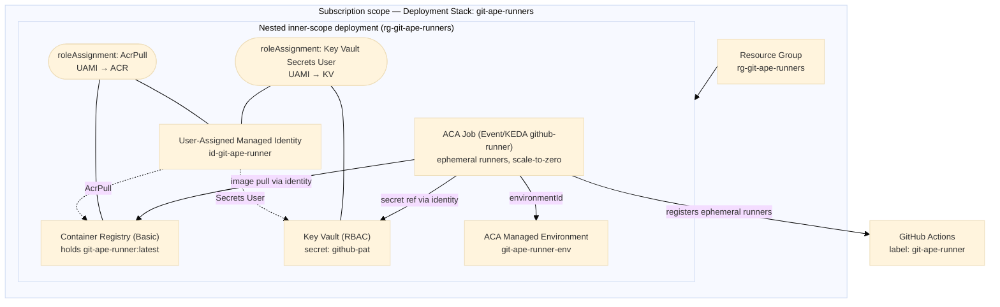
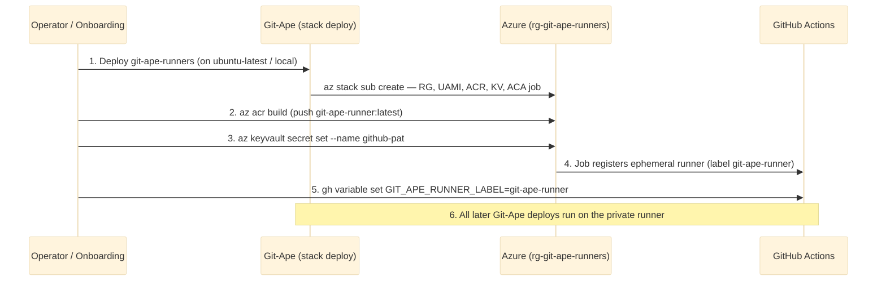

# Architecture — Git-Ape self-hosted runners

This deployment provisions the private GitHub Actions runner that runs **future
Git-Ape workflows** — i.e. Git-Ape deploying Git-Ape. It is a single
subscription-scoped **Azure Deployment Stack** (`template.json`), so it gets an
architecture diagram, cost estimate, managed deploy, and single-command destroy
like any other Git-Ape deployment.

## Resource topology

## Bootstrap ordering (self-hosting)

Git-Ape workflows run on `${{ vars.GIT_APE_RUNNER_LABEL || 'ubuntu-latest' }}`.
The **first** deploy of this stack can't run on the private runner (it doesn't
exist yet), so it runs on a public runner or locally. Once it's up and
`GIT_APE_RUNNER_LABEL` is set, every later Git-Ape run — **including updates to
this runner stack itself** — executes on the private runner it created.

## Secrets

The GitHub PAT is **never** in git, ARM parameters, or deployment history. The
stack creates an empty Key Vault; the PAT is written post-deploy with
`az keyvault secret set`. The ACA Job reads it at runtime through a Key Vault
secret reference (`keyVaultUrl` + user-assigned `identity`), which requires the
in-template **Key Vault Secrets User** role assignment.

## Destroy

`/azure-stack-destroy git-ape-runners` (or the `git-ape-destroy.yml` flow) runs
`az stack sub delete --action-on-unmanage deleteAll`, removing the RG, ACA job,
environment, ACR, identity, role assignments, and Key Vault in one call, then
purges the soft-deleted Key Vault (purge protection is intentionally off).
