# Git-Ape Private Runner Templates

These are **reference templates** for provisioning private GitHub Actions
runners that execute the Git-Ape deployment workflows (`git-ape-plan`,
`-deploy`, `-destroy`, `-verify`) with private network connectivity.

Git-Ape supports two private runner strategies:

| Strategy | Who manages compute? | Infrastructure you manage | Best for |
|----------|---------------------|--------------------------|----------|
| **Hosted compute networking** | GitHub | Azure VNet + subnet only | Private connectivity with zero runner management |
| **Self-hosted runners** | You | Full runner stack (ACI/ACA/AKS + image + scaling) | Custom images, air-gapped, compliance constraints |

> **Bootstrap model: Start on public runners, switch to private later — with one variable.**

## The runner switch: `GIT_APE_RUNNER_LABEL`

Every scaffolded Git-Ape workflow resolves its runner like this:

```yaml
runs-on: ${{ vars.GIT_APE_RUNNER_LABEL || 'ubuntu-latest' }}
```

| `GIT_APE_RUNNER_LABEL` | Effect |
|------------------------|--------|
| **unset** (default) | Jobs run on GitHub-hosted `ubuntu-latest`. No infrastructure. |
| Set to a hosted runner name (e.g. `git-ape-vnet-4vcpu`) | Jobs run on GitHub-hosted compute with Azure private networking. |
| Set to a self-hosted label (e.g. `git-ape-runner`) | Jobs target your self-hosted runners registered with that label. |

Switching is a one-line change and is fully reversible:

```bash
# Switch to hosted compute networking runner
gh variable set GIT_APE_RUNNER_LABEL --repo <org>/<repo> --body "git-ape-vnet-4vcpu"

# Switch to self-hosted runners
gh variable set GIT_APE_RUNNER_LABEL --repo <org>/<repo> --body "git-ape-runner"

# Clean fallback to GitHub-hosted runners (public)
gh variable delete GIT_APE_RUNNER_LABEL --repo <org>/<repo>
```

In multi-environment mode, set the variable per environment
(`--env azure-deploy-prod`) so only the environments that need private runners
use them.

---

## Option 1: Hosted Compute Networking (recommended)

**GitHub-hosted runners with Azure private networking.** GitHub manages the
compute (Ubuntu VMs with all standard tools pre-installed), but the runners
execute inside your Azure VNet for private connectivity to your resources.

> **Requires:** GitHub Enterprise Cloud. No custom image, no ACR, no KEDA —
> GitHub provides full Ubuntu images with `az`, `gh`, `jq`, `git` pre-installed.

**Reference:**
[About networking for hosted compute products](https://docs.github.com/en/enterprise-cloud@latest/admin/configuring-settings/configuring-private-networking-for-hosted-compute-products/about-networking-for-hosted-compute-products-in-your-enterprise)

### Scope: Organization vs Enterprise

Hosted compute network configurations can be created at two levels:

| Scope | `businessId` value | API endpoint | UI location |
|-------|-------------------|--------------|-------------|
| **Enterprise** | Enterprise `databaseId` (from GraphQL) | `enterprises/{slug}/network-configurations` | Enterprise Settings → Hosted compute networking |
| **Organization** | Org numeric ID (from REST API) | `orgs/{org}/settings/network-configurations` | Organization Settings → Hosted compute networking |

Enterprise-scoped configs can be shared across all orgs in the enterprise.
Organization-scoped configs are independent (requires enterprise policy to allow).

### Provisioning flow

```mermaid
flowchart LR
    A[Create Azure VNet<br/>+ /28 subnet] --> B[Delegate subnet to<br/>GitHub.Network/networkSettings]
    B --> C[Register GitHub.Network<br/>resource provider]
    C --> D[Create networkSettings<br/>Azure resource]
    D --> E[Create network config<br/>via GitHub API]
    E --> F[Create runner group<br/>linked to network config]
    F --> G[Create hosted runner<br/>in runner group]
    G --> H[Assign org/repo<br/>to runner group]
    H --> I[Set GIT_APE_RUNNER_LABEL<br/>= runner name]
```



### Step-by-step

1. **Create Azure VNet and subnet** (minimum `/28` — 16 IPs):
   ```bash
   az group create --name <rg> --location <region>
   az network vnet create --name <vnet> --resource-group <rg> \
     --address-prefix 10.0.0.0/16 --subnet-name snet-runners --subnet-prefix 10.0.0.0/28
   ```

2. **Delegate subnet** to `GitHub.Network/networkSettings`:
   ```bash
   az network vnet subnet update --name snet-runners --vnet-name <vnet> \
     --resource-group <rg> --delegations GitHub.Network/networkSettings
   ```

3. **Register the `GitHub.Network` resource provider** on the subscription:
   ```bash
   az provider register --namespace GitHub.Network
   az provider show --namespace GitHub.Network --query "registrationState" -o tsv
   # Wait until "Registered"
   ```

4. **Create the `GitHub.Network/networkSettings` resource:**
   ```bash
   # businessId = enterprise databaseId (enterprise scope) or org numeric ID (org scope)
   az rest --method PUT \
     --url "https://management.azure.com/subscriptions/<sub>/resourceGroups/<rg>/providers/GitHub.Network/networkSettings/<name>?api-version=2024-04-02" \
     --body '{
       "location": "<region>",
       "properties": {
         "businessId": "<enterprise-databaseId-or-org-id>",
         "subnetId": "/subscriptions/<sub>/resourceGroups/<rg>/providers/Microsoft.Network/virtualNetworks/<vnet>/subnets/snet-runners"
       }
     }'
   ```
   ⚠️ **`businessId` is immutable** — if wrong, you must delete and recreate the resource.

   The resource will have a `GitHubId` tag (a SHA-256 hash) — this is the ID
   GitHub uses to reference the network settings.

5. **Create the network configuration** on GitHub (use the `GitHubId` tag value,
   NOT the Azure resource ID):
   ```bash
   # Enterprise scope:
   gh api --method POST enterprises/<slug>/network-configurations \
     -f name="<config-name>" \
     -f compute_service="actions" \
     -f network_settings_ids[]="<GitHubId-tag-value>"

   # Organization scope:
   gh api --method POST orgs/<org>/settings/network-configurations \
     -f name="<config-name>" \
     -f compute_service="actions" \
     -f network_settings_ids[]="<GitHubId-tag-value>"
   ```

6. **Create a runner group** linked to the network configuration:
   ```bash
   # Enterprise scope:
   gh api --method POST enterprises/<slug>/actions/runner-groups \
     -f name="<group-name>" -f visibility="selected" \
     -F allows_public_repositories=false \
     -f network_configuration_id="<network-config-id-from-step-5>"

   # Organization scope:
   gh api --method POST orgs/<org>/actions/runner-groups \
     -f name="<group-name>" -f visibility="selected" \
     -F allows_public_repositories=false \
     -f network_configuration_id="<network-config-id-from-step-5>"
   ```

7. **Assign org/repo to the runner group:**
   ```bash
   # Enterprise: assign org
   gh api --method PUT enterprises/<slug>/actions/runner-groups/<group-id>/organizations/<org-id>
   # Org: assign repo (for inherited enterprise groups, use the inherited group ID at org level)
   gh api --method PUT orgs/<org>/actions/runner-groups/<group-id>/repositories/<repo-id>
   ```

8. **Create a hosted runner** in the group:
   ```bash
   # Query available images and sizes first:
   gh api orgs/<org>/actions/hosted-runners/images/github-owned
   gh api orgs/<org>/actions/hosted-runners/machine-sizes

   # Create runner (image IDs are NUMERIC, sizes are like "4-core"):
   echo '{"name":"<runner-name>","runner_group_id":<group-id>,"platform":"linux-x64","image":{"id":"<numeric-image-id>","source":"github"},"size":"4-core","maximum_runners":5}' | \
     gh api --method POST enterprises/<slug>/actions/hosted-runners --input -
   ```

9. **Set the variable:**
   ```bash
   gh variable set GIT_APE_RUNNER_LABEL --repo <org>/<repo> --body "<runner-name>"
   ```

10. **Verify** by triggering `Git-Ape: Verify Setup`.

### Key facts

- **No custom image needed** — GitHub's hosted compute uses full Ubuntu images
  with all standard tools (`az`, `gh`, `jq`, `git`, Docker, etc.)
- **No KEDA, no cold start** — runners are always available (status: "Ready")
- **`network_settings_ids`** expects the `GitHubId` tag value (SHA-256 hash
  from the Azure resource), NOT the Azure resource ID
- **Image IDs are numeric** (e.g., `"2295"` for Ubuntu 24.04) — query them via
  `GET orgs/{org}/actions/hosted-runners/images/github-owned`
- **Size IDs** are GitHub-specific (e.g., `"4-core"`, `"8-core"`) — query via
  `GET orgs/{org}/actions/hosted-runners/machine-sizes`
- **`businessId` is immutable** on the Azure resource — getting it wrong means
  delete + recreate

### Required GitHub token scopes

All scopes must be present **before** starting provisioning to avoid repeated
auth prompts:

| Scope | Purpose |
|-------|---------|
| `admin:org` | Create runner groups, assign repos |
| `admin:enterprise` | Enterprise-level runner groups and hosted runners |
| `manage_runners:org` | Create/manage hosted runners |
| `read:enterprise` | Query enterprise metadata (databaseId) |
| `write:network_configurations` | Create network configurations |

```bash
# Authenticate once with all required scopes:
gh auth refresh -h github.com -s admin:org,admin:enterprise,manage_runners:org,read:enterprise,write:network_configurations
```

---

## Option 2: Self-Hosted Runners (ACI / ACA / AKS)

Self-hosted runners run in **your** Azure subscription. You manage the compute,
image, scaling, and networking.

### Platform matrix

| | **Azure Container Instances (ACI)** | **Azure Container Apps (ACA)** | **Azure Kubernetes Service (AKS)** |
|---|---|---|---|
| **Basic** | [`aci/`](./aci) — single container group, simplest | [`aca/`](./aca) — KEDA-scaled ephemeral jobs | [`aks/`](./aks) — Actions Runner Controller (ARC) |
| **With private networking** | [`aci/`](./aci) with `subnetId` set | [`aca/`](./aca) with `infrastructureSubnetId` set | [`aks/`](./aks) — runners on cluster node subnet |

### Which platform?

| Choose | When |
|--------|------|
| **ACI** | Fewest moving parts. A handful of runners, simple scaling, fast to stand up. |
| **ACA** | You want **event-driven, ephemeral** runners that scale to zero between jobs (KEDA `github-runner` scaler). Best cost/utilization. |
| **AKS** | You already run AKS, need large-scale autoscaling, or want ARC's ephemeral runner pods and fine-grained scheduling. |

## Custom runner image (required)

> **⚠️ The base `ghcr.io/actions/actions-runner:latest` (GitHub's official runner
> image) does NOT include `az`, `gh`, or `jq`, and ships no registration
> entrypoint.** Git-Ape workflows will fail with
> `Unable to locate executable file: az` — and on ACI/ACA the runner never even
> registers — if you use it directly.

You **must** build and use the custom image from the [`Dockerfile`](./Dockerfile)
in this directory. It extends the base runner with all Git-Ape prerequisites and
an [`entrypoint.sh`](./entrypoint.sh) that self-registers the runner on ACI/ACA.

### Build with ACR Tasks (recommended — cloud build, no local Docker)

Always build the image in Azure using ACR Tasks. This avoids:
- Needing Docker installed locally
- **Windows CRLF line-ending corruption** — when the build context is uploaded
  from a Windows checkout (`git autocrlf`), `entrypoint.sh` may have `\r\n`
  endings. The Dockerfile includes a `sed` safety net, but cloud builds on ACR
  Tasks run in Linux and handle this cleanly.

```bash
# Create an ACR (one-time) — admin-enabled false; use managed identity for pulls
az acr create --name <acr-name> --resource-group <rg> --location <region> --sku Basic

# Build and push the image (runs in Azure, ~3 min)
az acr build --registry <acr-name> --image git-ape-runner:latest \
  --file .github/skills/git-ape-onboarding/templates/runners/Dockerfile \
  .github/skills/git-ape-onboarding/templates/runners/
```

> **Windows note:** `az acr build` may crash with a `charmap` codec error while
> streaming build logs (Unicode characters in `apt-get` output). Add `--no-logs`
> to skip log streaming — the build still runs in Azure:
> ```bash
> az acr build --registry <acr-name> --image git-ape-runner:latest \
>   --file ... ... --no-logs
> ```
> Check the result with `az acr repository list --name <acr-name>`.

### ACR pull authentication (managed identity — recommended)

Use a **user-assigned managed identity** with the `AcrPull` role to pull images
from your ACR. This eliminates admin credentials entirely.

```bash
# Create a managed identity (one-time)
az identity create --name id-git-ape-runner --resource-group <rg> --location <region>

# Get the identity's principal ID and resource ID
IDENTITY_ID=$(az identity show --name id-git-ape-runner --resource-group <rg> --query id -o tsv)
PRINCIPAL_ID=$(az identity show --name id-git-ape-runner --resource-group <rg> --query principalId -o tsv)
ACR_ID=$(az acr show --name <acr-name> --query id -o tsv)

# Assign AcrPull role
az role assignment create --assignee-object-id $PRINCIPAL_ID --assignee-principal-type ServicePrincipal \
  --role AcrPull --scope $ACR_ID

# Deploy the ACA template with managed identity + ACR server
az deployment group create -g <rg> -f template.json \
  -p runnerImage='<acr-name>.azurecr.io/git-ape-runner:latest' \
     acrServer='<acr-name>.azurecr.io' \
     userAssignedIdentityId=$IDENTITY_ID \
     githubOwnerRepo='org/repo' \
     githubAccessToken='<from-keyvault>'
```

The ACA template's `registries` block automatically uses identity-based auth
when both `acrServer` and `userAssignedIdentityId` are set — no username/password.

### Legacy: ACR admin credentials (not recommended)

If you cannot use managed identity, enable admin access and configure pull
credentials manually:

```bash
az acr update --name <acr-name> --admin-enabled true
az containerapp job registry set --name git-ape-runner --resource-group <rg> \
  --server <acr-name>.azurecr.io --username <acr-name> \
  --password $(az acr credential show -n <acr-name> --query "passwords[0].value" -o tsv)
```

### Tools included in the custom image

| Tool | Minimum version | Purpose |
|------|----------------|---------|
| `az` | 2.50+ | Azure CLI — OIDC login, deployments, resource management |
| `gh` | 2.0+ | GitHub CLI — PR comments, workflow dispatch |
| `jq` | 1.6+ | JSON processing in shell scripts |
| `git` | (any) | Checkout, commit state files |

## KEDA cold-start considerations

The KEDA `github-runner` scaler polls the GitHub Actions queue every 30 seconds.
On a fresh deployment, there can be a delay of 1–3 minutes before KEDA detects
queued jobs and spins up a runner. During this window, GitHub shows the job as
"Waiting for a runner" and the Settings page shows "No runners configured"
(ephemeral runners only exist during job execution).

**Recommendations:**

- **Set `minExecutions=1`** if you want at least one runner always warm and
  visible in GitHub Settings. This eliminates cold-start delays at the cost of
  one always-running container (~$30–50/month on Consumption plan).
  ```bash
  az containerapp job update --name git-ape-runner --resource-group <rg> --min-executions 1
  ```
- **Leave `minExecutions=0`** (default) for true scale-to-zero if you can
  tolerate 1–3 minute cold starts. Runners will appear in GitHub only while
  jobs are executing.
- **Fine-grained PATs** work with the KEDA scaler but require
  `administration:write` permission on the target repo.

## Security model

- **Azure access uses a managed identity, never secrets.** Each template
  attaches a **user-assigned managed identity** to the runner so the workflows
  can authenticate to Azure (the runner host identity) — but Git-Ape workflows
  still use **OIDC federation** for `az` actions, so the managed identity only
  needs what the runtime requires. Do not put subscription keys or connection
  strings on the runner.
- **ACR image pull uses managed identity, not admin credentials.** The managed
  identity assigned to the runner should have the `AcrPull` role on the ACR.
  The ACA template supports identity-based registry auth natively via the
  `acrServer` + `userAssignedIdentityId` parameters — no username/password.
  ACR admin credentials are a legacy fallback and should be avoided.
- **The GitHub registration credential is the one unavoidable secret.** GitHub
  requires a credential to register a runner. Order of preference:
  1. **GitHub App** installation token (recommended for org-scale; ARC supports
     this natively).
  2. **Fine-grained PAT** with `administration:write` (repo runners) or
     organization `self-hosted runners` write (org runners).
  Source it from **Azure Key Vault** (`securestring` params + Key Vault
  reference), never inline it in a committed `parameters.json`.
- **Ephemeral runners by default.** Templates register **ephemeral** runners
  (one job per runner, then re-register). This prevents state leaking between
  jobs — important when runners are shared across deployments.
- **Label scoping.** All templates register the runner with the label
  `git-ape-runner` (override via parameter). That label is what
  `GIT_APE_RUNNER_LABEL` must match.

## Provisioning flow (all platforms)

```mermaid
flowchart LR
    A[Choose type + platform] --> B[Create ACR +<br/>build custom image<br/>via ACR Tasks]
    B --> C[Create managed identity<br/>+ AcrPull role]
    C --> D[Copy template into<br/>.azure/runners/]
    D --> E[Provide GitHub creds<br/>via Key Vault]
    E --> F[Deploy IaC<br/>az deployment / helm]
    F --> G[Set minExecutions=1<br/>runner registers]
    G --> H[Runner registers<br/>with label git-ape-runner]
    H --> I[Set GIT_APE_RUNNER_LABEL<br/>variable]
    I --> J[Workflows now run<br/>on private runners]
    J -.clean fallback.-> K[Unset variable →<br/>back to ubuntu-latest]
```



1. **Choose** the runner type and platform (the `/git-ape-onboarding` flow asks).
2. **Create an ACR** and build the custom runner image using ACR Tasks (cloud
   build — avoids CRLF issues and requires no local Docker). Create a
   **user-assigned managed identity** with `AcrPull` role for image pulls — do
   not use ACR admin credentials.
3. **Copy** the chosen platform folder into your repo under
   `.azure/runners/<platform>/` and edit parameters for your repo/org, region,
   labels, image, and (for VNet-injected) the target `subnetId`.
4. **Store the GitHub credential** in Key Vault and reference it from the
   secure parameter — do not commit it.
5. **Deploy** the runner infrastructure (see each platform's README/notes).
6. **Confirm** the runner is **online** in
   *GitHub → Settings → Actions → Runners* with the `git-ape-runner` label.
   (With `minExecutions=0`, the runner only appears while a job is running.)
7. **Set** `GIT_APE_RUNNER_LABEL=git-ape-runner` (repo or per-environment).
8. **Verify** by running the `Git-Ape: Verify Setup` workflow — its *Runner
   Configuration* step reports the active runner mode.

## Note on the drift workflow

`git-ape-drift.lock.yml` is a **compiled GitHub Agentic Workflow** (gh-aw). Its
runner is fixed at compile time and gh-aw only supports GitHub-hosted Ubuntu
labels for its agent job. To run continuous drift detection on a private runner,
set `runs-on:` (and optionally `runs-on-slim:`) in the **source**
`git-ape-drift.md` frontmatter to a supported label and recompile with
`gh aw compile`. Do **not** hand-edit the `.lock.yml` — it carries an integrity
hash and will fail its stale-lock check. The other four workflows honor
`GIT_APE_RUNNER_LABEL` directly with no recompile.
