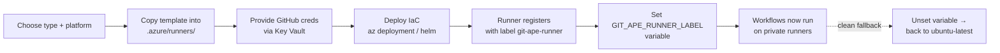

# Git-Ape self-hosted runner templates

These are **reference Infrastructure-as-Code templates** for provisioning private
GitHub Actions runners that execute the Git-Ape deployment workflows
(`git-ape-plan`, `-deploy`, `-destroy`, `-verify`) inside **your** Azure
subscription instead of on GitHub-hosted runners.

They are **not** scaffolded into your repository automatically. The
`/git-ape-onboarding` flow copies and customizes the template for the runner
type and platform you choose, then provisions it. The bootstrap model is:

> **Start on public runners, switch to private runners later — with one variable.**

## The runner switch: `GIT_APE_RUNNER_LABEL`

Every scaffolded Git-Ape workflow resolves its runner like this:

```yaml
runs-on: ${{ vars.GIT_APE_RUNNER_LABEL || 'ubuntu-latest' }}
```

| `GIT_APE_RUNNER_LABEL` | Effect |
|------------------------|--------|
| **unset** (default) | Jobs run on GitHub-hosted `ubuntu-latest`. No infrastructure. |
| set to a label (default `git-ape-runner`) | Jobs target your self-hosted runners registered with that label. |

Switching is a one-line change and is fully reversible:

```bash
# Switch to private runners (after they are provisioned and online)
gh variable set GIT_APE_RUNNER_LABEL --repo <org>/<repo> --body "git-ape-runner"

# Clean fallback to GitHub-hosted runners
gh variable delete GIT_APE_RUNNER_LABEL --repo <org>/<repo>
```

In multi-environment mode, set the variable per environment
(`--env azure-deploy-prod`) so only the environments that need private runners
use them.

## Runner type × platform matrix

| | **Azure Container Instances (ACI)** | **Azure Container Apps (ACA)** | **Azure Kubernetes Service (AKS)** |
|---|---|---|---|
| **Self-hosted (subscription)** | [`aci/`](./aci) — single container group, simplest | [`aca/`](./aca) — KEDA-scaled ephemeral jobs | [`aks/`](./aks) — Actions Runner Controller (ARC) |
| **VNet-injected** | [`aci/`](./aci) with `subnetId` set | [`aca/`](./aca) with `infrastructureSubnetId` set | [`aks/`](./aks) — runners on cluster node subnet |

- **Self-hosted (subscription)** — runners are Azure resources in your
  subscription with outbound internet. Gives you control over image, region,
  and identity without managing a VNet.
- **VNet-injected** — runners run inside a subnet of a VNet you manage, for
  workloads that need private connectivity to Azure resources (private
  endpoints, no public egress except to GitHub). Choose this when deployments
  must reach VNet-isolated targets or when policy forbids public runners.

### Which platform?

| Choose | When |
|--------|------|
| **ACI** | Fewest moving parts. A handful of runners, simple scaling, fast to stand up. |
| **ACA** | You want **event-driven, ephemeral** runners that scale to zero between jobs (KEDA `github-runner` scaler). Best cost/utilization. |
| **AKS** | You already run AKS, need large-scale autoscaling, or want ARC's ephemeral runner pods and fine-grained scheduling. |

## Security model

- **Azure access uses a managed identity, never secrets.** Each template
  attaches a **user-assigned managed identity** to the runner so the workflows
  can authenticate to Azure (the runner host identity) — but Git-Ape workflows
  still use **OIDC federation** for `az` actions, so the managed identity only
  needs what the runtime requires. Do not put subscription keys or connection
  strings on the runner.
- **The GitHub registration credential is the one unavoidable secret.** GitHub
  requires a credential to register a runner. Order of preference:
  1. **GitHub App** installation token (recommended for org-scale; ARC supports
     this natively).
  2. **Fine-grained PAT** with `administration:write` (repo runners) or
     organization `self-hosted runners` write (org runners).
  Source it from **Azure Key Vault** (`securestring` params + Key Vault
  reference), never inline it in a committed `parameters.json`.
- **Ephemeral runners by default.** Templates register **ephemeral** runners
  (one job per runner, then re-register). This prevents state leaking between
  jobs — important when runners are shared across deployments.
- **Label scoping.** All templates register the runner with the label
  `git-ape-runner` (override via parameter). That label is what
  `GIT_APE_RUNNER_LABEL` must match.

## Provisioning flow (all platforms)



1. **Choose** the runner type and platform (the `/git-ape-onboarding` flow asks).
2. **Copy** the chosen platform folder into your repo under
   `.azure/runners/<platform>/` and edit parameters for your repo/org, region,
   labels, and (for VNet-injected) the target `subnetId`.
3. **Store the GitHub credential** in Key Vault and reference it from the
   secure parameter — do not commit it.
4. **Deploy** the runner infrastructure (see each platform's README/notes).
5. **Confirm** the runner is **online** in
   *GitHub → Settings → Actions → Runners* with the `git-ape-runner` label.
6. **Set** `GIT_APE_RUNNER_LABEL=git-ape-runner` (repo or per-environment).
7. **Verify** by running the `Git-Ape: Verify Setup` workflow — its *Runner
   Configuration* step reports the active runner mode.

## Note on the drift workflow

`git-ape-drift.lock.yml` is a **compiled GitHub Agentic Workflow** (gh-aw). Its
runner is fixed at compile time and gh-aw only supports GitHub-hosted Ubuntu
labels for its agent job. To run continuous drift detection on a private runner,
set `runs-on:` (and optionally `runs-on-slim:`) in the **source**
`git-ape-drift.md` frontmatter to a supported label and recompile with
`gh aw compile`. Do **not** hand-edit the `.lock.yml` — it carries an integrity
hash and will fail its stale-lock check. The other four workflows honor
`GIT_APE_RUNNER_LABEL` directly with no recompile.
