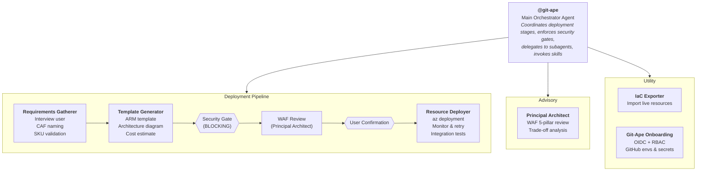
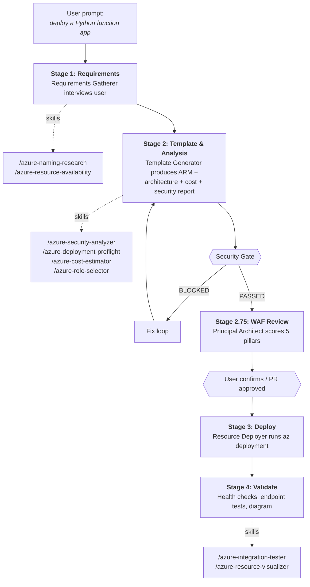
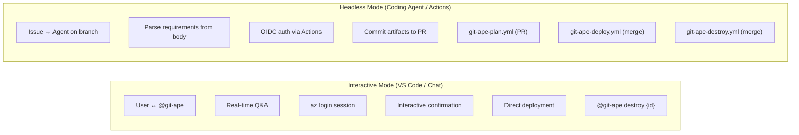

# Git-Ape

> [!WARNING]
> EXPERIMENTAL PROJECT: Git-Ape is in active development and is not production-ready.
> Use it for local development, demos, sandbox subscriptions, and learning only.


**📖 Documentation:** [azure.github.io/git-ape](https://azure.github.io/git-ape/)

Git-Ape is a **platform engineering framework** built on GitHub Copilot. It provides a structured, multi-agent system for planning, validating, and deploying Azure infrastructure — with security gates, cost analysis, and CI/CD pipeline integration built in.

## What It Is

Git-Ape packages a set of Copilot agents and skills focused on Azure infrastructure work.

- It helps you gather deployment requirements.
- It generates ARM templates and supporting deployment artifacts.
- It runs security, preflight, and cost checks before deployment.
- It supports onboarding and post-deployment validation.

## What It Does

Git-Ape is designed around a simple deployment flow:

1. Collect the inputs for the resources you want.
2. Generate and review the template, naming, cost, and security results.
3. Ask for confirmation before anything changes in Azure.
4. Deploy and run follow-up validation.

Common tasks it supports:

- Deploying Azure application stacks such as Function Apps, Web Apps, Storage, SQL, Cosmos DB, and Container Apps.
- Bootstrapping repository onboarding for OIDC, RBAC, GitHub environments, and secrets.
- Saving deployment artifacts under `.azure/deployments/` for audit and reuse.
- Detecting configuration drift between Azure and stored deployment state (agentic workflow — coming soon).
- 
## Git-Ape in action

A short demo video of the onboarding and deploy experience using Git-Ape.

[](https://www.youtube.com/watch?v=Td6rv_RGArQ)


## Get Started

### Prerequisite
- Only tested with BASH shells (git-bash for windows)
- Run `/prereq-check` in Copilot Chat to verify all required tools (`az`, `gh`, `jq`, `git`) and auth sessions

### 1. Install the plugin

Recommended:

```bash
copilot plugin marketplace add Azure/git-ape
copilot plugin install git-ape@git-ape
```

Verify the installation:

```bash
copilot plugin list   # Should show: git-ape@git-ape
```

Manual option:

1. Clone this repository.
2. Open it in VS Code with GitHub Copilot enabled.
3. Confirm the agents appear in chat.

### 2. Configure Azure access

1. Install Azure CLI and sign in with `az login`.
2. Configure the Azure MCP server in VS Code.
3. Verify the required Azure services are enabled.

Setup details are in [docs/AZURE_MCP_SETUP.md](docs/AZURE_MCP_SETUP.md).

### 3. Use the agents

Start with one of these prompts in Copilot Chat:

- `@git-ape deploy a Python function app`
- `@git-ape deploy a web app with SQL database`
- `@Git-Ape Onboarding set up this repo for Azure deployments`

### 4. Tear Down
Use @git-ape to clean up afterwards by using:
- `@git-ape destroy Python function app`

## Where To Go Next

- [docs/EXAMPLES.md](docs/EXAMPLES.md): Longer end-to-end examples and sample conversations.
- [docs/AZURE_MCP_SETUP.md](docs/AZURE_MCP_SETUP.md): Azure MCP server configuration for VS Code.
- [docs/DEPLOYMENT_STATE.md](docs/DEPLOYMENT_STATE.md): How deployment artifacts are stored and reused.
- [docs/ONBOARDING.md](docs/ONBOARDING.md): Repository onboarding, OIDC, RBAC, and GitHub environment setup.
- [docs/CODESPACES.md](docs/CODESPACES.md): GitHub Codespaces and dev container setup.

## Architecture

`@git-ape` is the central orchestrator. It coordinates a deployment pipeline of specialized subagents, enforces security gates, invokes skills, and manages deployment state. It does not deploy anything without explicit user confirmation.

### Agent & Skill Orchestration



### Skills

Skills are invoked by agents at specific stages. Each skill handles one focused task.

| Phase | Skill | Purpose |
|-------|-------|---------|
| **Pre-Deploy** | `/azure-naming-research` | CAF abbreviation lookup, naming constraint validation |
| | `/azure-resource-availability` | SKU restrictions, version support, API compatibility, quota |
| | `/azure-security-analyzer` | Per-resource security assessment with blocking gate |
| | `/azure-deployment-preflight` | What-if analysis and permission checks before deploy |
| | `/azure-role-selector` | Least-privilege RBAC role recommendations |
| | `/azure-cost-estimator` | Real-time cost estimation via Azure Retail Prices API |
| | `/prereq-check` | Verify required CLI tools and auth sessions are ready |
| **Post-Deploy** | `/azure-integration-tester` | Post-deployment health checks and endpoint tests |
| | `/azure-resource-visualizer` | Generate Mermaid diagrams from live Azure resources |
| **Operations** | `/azure-drift-detector` | Detect config drift between live Azure and stored state |
| | `/git-ape-onboarding` | Guided setup for OIDC, RBAC, environments, and secrets |

### Deployment Flow



### Execution Modes

Git-Ape works in two modes — same agents and skills, different execution context.



**Interactive** — you talk to `@git-ape` in VS Code Copilot Chat, authenticate via `az login`, and approve each step in real time.

**Headless** — the Copilot Coding Agent picks up a GitHub issue, generates the template on a branch, opens a PR, and the CI/CD workflows (`git-ape-plan`, `git-ape-deploy`, `git-ape-destroy`) handle validation, deployment, and teardown via OIDC.

### CI/CD Workflows

| Workflow | Trigger | Purpose |
|----------|---------|---------|
| `git-ape-plan.yml` | PR with template changes | Validate, what-if, post plan as PR comment |
| `git-ape-deploy.yml` | Merge to main or `/deploy` comment | Execute ARM deployment |
| `git-ape-destroy.yml` | Merge PR with `destroy-requested` | Delete resource group |
| `git-ape-verify.yml` | Manual dispatch | Verify OIDC, RBAC, pipeline health |

> **Note:** Drift detection and TTL-based cleanup were previously handled by scheduled workflows (`git-ape-drift.yml`, `git-ape-ttl-reaper.yml`). These are being replaced by agentic workflows — coming soon.

## Included Components

Git-Ape is packaged as a Copilot CLI plugin with agents and skills under `.github/`:

```
plugin.json                          # Plugin manifest
.github/
├── agents/
│   ├── git-ape.agent.md             # Main orchestrator
│   ├── git-ape-onboarding.agent.md  # Onboarding agent
│   ├── azure-requirements-gatherer.agent.md
│   ├── azure-template-generator.agent.md
│   ├── azure-resource-deployer.agent.md
│   ├── azure-principal-architect.agent.md
│   └── azure-iac-exporter.agent.md
├── skills/
│   ├── git-ape-onboarding/          # OIDC, RBAC, env setup
│   ├── azure-naming-research/       # CAF naming
│   ├── azure-resource-availability/ # SKU & quota checks
│   ├── azure-security-analyzer/     # Security assessment
│   ├── azure-deployment-preflight/  # What-if analysis
│   ├── azure-role-selector/         # RBAC recommendations
│   ├── azure-cost-estimator/        # Cost estimation
│   ├── azure-drift-detector/        # Drift detection
│   ├── azure-integration-tester/    # Post-deploy tests
│   └── azure-resource-visualizer/   # Architecture diagrams
└── workflows/
    ├── git-ape-plan.yml
    ├── git-ape-deploy.yml
    ├── git-ape-destroy.yml
    └── git-ape-verify.yml
```

See [plugin.json](plugin.json) and [.github/plugin/marketplace.json](.github/plugin/marketplace.json) for packaging details.

## License

MIT License. See [LICENSE](LICENSE).
