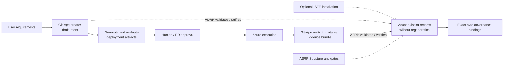

# Proposal: Portable Intent and Evidence with Optional ISEE Governance

## Summary

Git-Ape should preserve the decisions that led to a deployment, and the
evidence produced by it, even when the user has not installed ISEE.

The proposed implementation makes Git-Ape a standalone producer of portable
Intent and Evidence records using its existing Bash, `jq`, Git, and SHA-256
toolchain. ISEE remains optional: when installed later, it can validate,
ratify, bind, and independently verify the records Git-Ape already created.

This keeps Git-Ape independently useful while providing a clean compatibility
path into the wider ISEE ecosystem.

## Proposed boundary

An editable version of the diagram is available at
[`diagrams/git-ape-isee-compatibility.excalidraw`](diagrams/git-ape-isee-compatibility.excalidraw).

## What changes in Git-Ape

- Onboarding and deployment requirements are preserved as
  `ape-decision-record/v1` draft Intent.
- Every deployment attempt can emit an immutable
  `aerp-evidence-bundle/v1`, including failed attempts.
- Canonical fingerprints and artifact digests make later drift or replacement
  detectable.
- Planning and deployment block when requirements have changed but Intent has
  not been refreshed.
- An `adopt-existing.sh` command lets users install ISEE later and govern the
  records already present.

## What does not change

- Git-Ape does not require ISEE, Ape Context, Python, or another runtime.
- `state.json` remains the source of truth for Azure deployment lifecycle.
- Native Intent remains `draft`; only ADRP can establish ratification or
  authority.
- Native Evidence remains `generated`; it becomes `verified` only after AERP
  validation and artifact verification.
- Evidence failure does not rewrite a successful Azure deployment or trigger
  an automatic rollback.
- Adoption never silently installs tooling, regenerates records, ratifies
  Intent, or accepts changed artifact bytes.

## Compatibility modes

| Mode | Behaviour |
|---|---|
| Standalone | Git-Ape creates portable draft Intent and generated Evidence. |
| Optional ISEE | Existing records are validated and bound when profile tooling is available. |
| Required ISEE | Planning or deployment blocks unless ratification, tooling, bindings, gates, fingerprints, and artifact digests are valid. |

## Why this approach

The main design goal is to avoid two undesirable extremes:

1. losing Intent and Evidence unless users install the full ISEE suite first;
2. coupling Git-Ape's normal operation to an external governance runtime.

Producing the versioned formats natively gives Git-Ape durable records from day
one. Keeping authority and independent verification in ADRP, ASRP, and AERP
preserves honest lifecycle semantics and separation of responsibilities.

## Current implementation status

The working branch includes onboarding and workflow integration, native record
production, delayed adoption, documentation, scaffold support, end-to-end
tests, and behavioural evaluations. It has been checked against the
authoritative ADRP and AERP validators, including Evidence verification against
the original deployment artifacts.

## Maintainer decision requested

Agreement is requested on the architectural boundary:

- Git-Ape owns portable record production.
- ISEE profiles own authority, governed Structure, and independent
  verification.
- ISEE adoption must reuse exact existing records rather than regenerate them.

If we agree on that boundary, the implementation can be reviewed as a
backwards-compatible Git-Ape capability rather than a required ISEE
integration.
