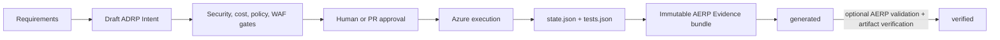

# Intent, Evidence, and ISEE adoption

Git-Ape preserves Intent and Evidence as part of normal operation. Ape Context
and the ISEE suite are not prerequisites for record portability.

:::warning
Git-Ape remains experimental. Review all generated records and governance
configuration before relying on them.
:::

## Standalone producer contract

Git-Ape uses its existing Bash, `jq`, and SHA-256 tooling to produce:

| Record | Location | Native lifecycle status |
|---|---|---|
| Onboarding Intent | `.github/ape-decisions/` | `draft` |
| Deployment Intent | `.azure/deployments/<id>/intent.json` | `draft` |
| Evidence bundle | `.azure/deployments/<id>/evidence/bundles/<run>.json` | `generated` |
| Execution trace | `.azure/deployments/<id>/traces/<run>.json` | workflow observation |

Native Git-Ape does not claim decision authority or independent verification.
The separate status files preserve that distinction:

```text
.github/git-ape/onboarding-intent-status.json
.azure/deployments/<id>/intent-status.json
.azure/deployments/<id>/evidence-status.json
```

## Structured execution traces

The deploy workflow records the path it actually observed rather than relying
on an agent to report that every gate ran. A canonical declared graph is copied
to `execution-graph.json` and archived as
`execution-graphs/<run-id>-<run-attempt>.json`; workflow step outcomes produce
explicit node and transition events in an immutable per-attempt trace.

The `deployment_authorized` node is backed by `authorization.json`. The
workflow resolves the triggering commit to exactly one merged pull request
targeting `main` and requires an effective approval before Azure execution.
Direct pushes, ambiguous commit associations, and unapproved merges are
recorded as rejected authorization attempts and fail closed.

Native validation checks:

- the trace is bound to the exact graph bytes;
- every observed node and transition is declared;
- transitions carry their required Evidence identifiers;
- ordered traces alternate node and transition events and follow a continuous path;
- a successful run completed every required node and terminal.

Trace conformance does not prove that Evidence contents are correct or that a
control was effective. The trace, validation report, and referenced artifacts
are included together in the Evidence bundle so AERP can later verify their
exact bytes.

## Deployment lifecycle



Evidence is emitted for failed attempts as well as successful deployments.
Execution truth remains in `state.json`; an Evidence failure does not rewrite
Azure deployment status or trigger rollback by itself.

## Install ISEE later

After installing ADRP, ASRP, and AERP, adopt records that Git-Ape already
created:

```bash
.github/git-ape/isee/adopt-existing.sh \
  --deployment-id <id> \
  --mode optional
```

The command:

1. validates the existing Intent when ADRP is installed;
2. validates and artifact-verifies every existing Evidence bundle when AERP is installed;
3. creates `isee-bindings.json` from current canonical fingerprints and exact artifact digests;
4. runs the Git-Ape governance preflight;
5. writes `isee-adoption.json`;
6. promotes the current Evidence status only after independent verification.

It does **not** install tooling, regenerate records, silently accept changed
artifacts, or ratify Intent.

## Required governance

Required governance needs an ADRP-ratified Intent. Ratification is an explicit
authority action and creates a separate immutable record version:

```bash
adrp ratify \
  --target .azure/deployments/<id>/intent.json \
  --output .github/ape-decisions/<ratified-record>.json \
  --confirmed-by "<identity>" \
  --authority-role "<role>" \
  --approval-meaning "<meaning>" \
  --context-fingerprint "sha256:<digest>"
```

Adopt the ratified record:

```bash
.github/git-ape/isee/adopt-existing.sh \
  --deployment-id <id> \
  --mode required \
  --intent .github/ape-decisions/<ratified-record>.json
```

Required governance blocks planning and deployment when profile tooling,
ratification, bindings, manifests, fingerprints, or approved artifact bytes do
not match.

## Optional Structure

Bind one or more ASRP Structure records and an execution manifest:

```bash
.github/git-ape/isee/adopt-existing.sh \
  --deployment-id <id> \
  --mode required \
  --intent .github/ape-decisions/<ratified-record>.json \
  --structure .github/ape-structures/<structure>.json \
  --execution-manifest .github/ape-structures/<manifest>.json
```

The original Git-Ape artifacts remain the execution and Evidence source. ASRP
adds governed Structure, gates, and execution bindings around them.

## Files after adoption

```text
.azure/deployments/<id>/
├── intent.json
├── intent-status.json
├── template.json
├── parameters.json
├── state.json
├── tests.json
├── execution-graph.json
├── execution-graphs/
│   └── <run>-<attempt>.json
├── traces/
│   └── <run>-<attempt>.json
├── trace-validations/
│   └── <run>-<attempt>.json
├── evidence-status.json
├── evidence/
│   └── bundles/
│       └── <run>-<attempt>.json
├── isee-bindings.json
├── governance-status.json
└── isee-adoption.json
```
