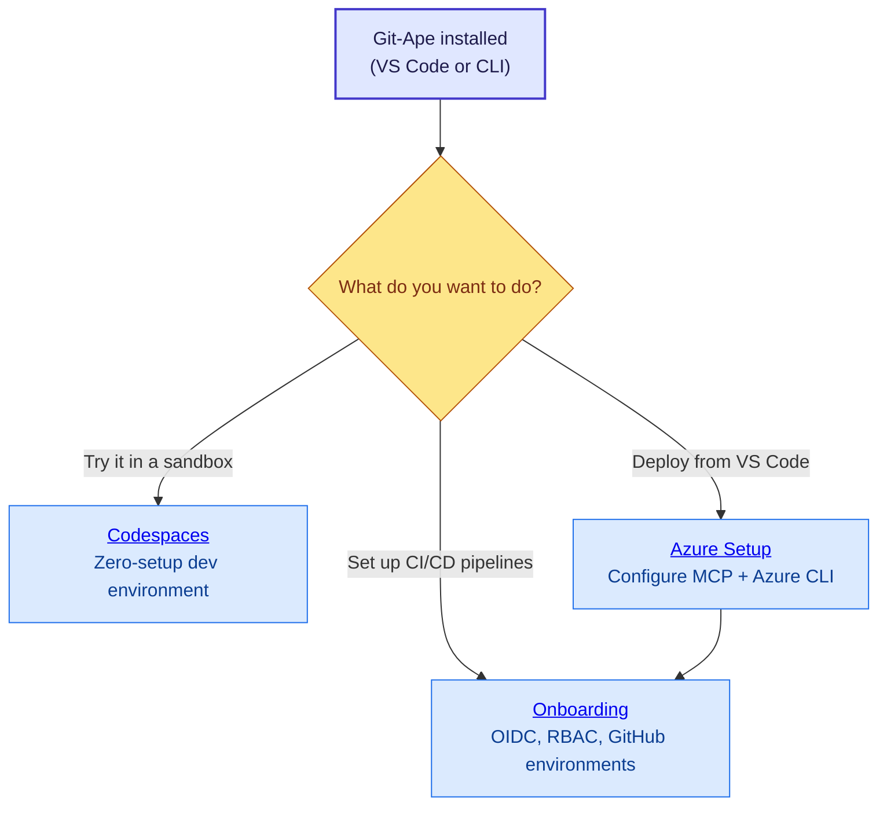

# Installation & Prerequisites

## Prerequisites

Before you start, make sure you have:

- **A Bash-compatible shell** — macOS and Linux work out of the box. On Windows, install [Git for Windows](https://gitforwindows.org/) and use Git Bash.
- **Azure CLI, GitHub CLI, jq, and git** — installed and authenticated.

:::tip[Quick check]
Run `/prereq-check` in Copilot Chat after installation. It validates every tool and auth session for you and shows platform-specific install commands for anything missing.
:::

## Which installation method should I use?

| Method | Best for | Requirements |
|--------|----------|--------------|
| **VS Code Marketplace** | One-click install for VS Code users | VS Code + Copilot |
| **VS Code marketplaces setting** | Advanced workflows, multi-plugin marketplaces | VS Code + Copilot + `chat.plugins.enabled` |
| **Copilot CLI plugin** | Terminal-first workflows or CI scripting | Copilot CLI |
| **Local dev install** | Contributing to Git-Ape itself | Git clone of the repo |
| **GitHub Codespaces** | Trying Git-Ape without any local setup | GitHub account |

Most users should start with the **VS Code Marketplace** option. If you just want to try Git-Ape without installing anything, jump to [Codespaces](./codespaces).

## Option A: VS Code Marketplace (one-click) {#vscode-marketplace}

The fastest way to install Git-Ape in VS Code. The published listing bundles all agents and skills as a regular VS Code extension — no `chat.plugins.enabled` setting required.

[](https://marketplace.visualstudio.com/items?itemName=Git-ApeTeam.git-ape) [](pathname:///install.html) [](pathname:///install-insiders.html)

1. Open the [Git-Ape listing on the VS Code Marketplace](https://marketplace.visualstudio.com/items?itemName=Git-ApeTeam.git-ape) and click **Install**, or use one of the badges above to open VS Code directly.
2. Verify the agents and skills appear in Copilot Chat — type `@git-ape` or `/prereq-check`.

:::tip[Direct install URI]
You can also paste `vscode:extension/Git-ApeTeam.git-ape` into your browser to launch VS Code and install in one step. Use `vscode-insiders:extension/Git-ApeTeam.git-ape` for VS Code Insiders.
:::

## Option B: VS Code marketplaces setting {#vscode-plugin}

Your organization must have the `chat.plugins.enabled` setting set to `true`. If you are unsure, ask your admin or try the steps below — VS Code will tell you if plugins are disabled.

1. Add the Git-Ape marketplace to your VS Code `settings.json`:

   [](pathname:///open-settings.html) [](pathname:///open-settings-insiders.html)

   ```jsonc
   "chat.plugins.marketplaces": [
       "Azure/git-ape"
   ]
   ```

2. Open the Extensions view (`⇧⌘X` on macOS, `Ctrl+Shift+X` on Windows/Linux), search for `@agentPlugins`, find **git-ape**, and select **Install**.

   Alternatively, open the Command Palette (`⇧⌘P` / `Ctrl+Shift+P`), run **Chat: Install Plugin From Source**, and enter `https://github.com/Azure/git-ape`.

3. Verify the agents and skills appear in Copilot Chat — type `@git-ape` or `/prereq-check`.

## Option C: Copilot CLI plugin {#cli-plugin}

```bash
copilot plugin marketplace add Azure/git-ape
copilot plugin install git-ape@git-ape
copilot plugin list   # Should show: git-ape@git-ape
```

## Option D: Local development install {#local-dev}

Use this if you are contributing to Git-Ape or want to test local changes.

```bash
git clone https://github.com/Azure/git-ape.git
```

Register the local checkout in your VS Code `settings.json`:

```jsonc
"chat.pluginLocations": {
    "/absolute/path/to/git-ape": true
}
```

Reload VS Code; the `@git-ape` agent and skills will appear in Copilot Chat.

## Verify installation

In Copilot Chat, type:

```text
@git-ape hello
```

You should see the Git-Ape orchestrator respond. If it does not, reload the VS Code window (`Cmd+Shift+P` → **Developer: Reload Window**).

## Discover and install additional skills

After installing Git-Ape through VS Code or Copilot CLI, you have its core
agents, core skills, and `/git-ape-skills`. The unified registry includes
community discovery metadata, but listing a community skill does not install
or activate it. The VSIX excludes community source entirely; Git-based plugin
installation may download the repository containing that source outside the
core skill-loader path.

### Search the registry

```text
/git-ape-skills search AWS
```

You can also ask `@git-ape find a skill for AWS Lambda`. Results show matching
skills, descriptions, authors, sources, and documentation. Community results
are optional and are not available merely because they appear in the registry.
Search runs locally and makes no workspace changes.

There are currently no submitted community skills. An AWS search will return
no community match until one is contributed through an Azure/git-ape PR.

### Review and approve a selected skill

```text
/git-ape-skills install <skill-name>
```

Installation requires Node.js and an authenticated GitHub CLI (`gh`). Git-Ape
identifies your destination workspace, resolves a pinned Azure/git-ape commit,
and shows the selected skill and supporting files. Approve the skill, commit,
and destination before any files are written.

Community content comes from Azure/git-ape, not the author's external source
URL. PR review provides oversight and provenance, not a guarantee of safety.

### Install into the workspace

The complete selected directory is copied into your repository:

```text
your-repository\
  .github\
    skills\
      <skill-name>\
        SKILL.md
        scripts\
        references\
        .git-ape-provenance.json
```

Supporting scripts and references are copied when present. The installer
refuses overwrites, records the pinned source revision, and does not execute
scripts or install dependencies. You can review and commit these workspace
changes for your team.

### Use the installed skill

Reload your client or start a new session if needed, then invoke
`/<skill-name>` once the client discovers it. Git-Ape routes to a community
skill only when it is available in the current session.

Installation is workspace-scoped, not global. Other repositories do not
automatically receive the skill. Client discovery requires support for
workspace `.github/skills/` directories; live client activation has not been
verified as part of this implementation.

## What's next?

You have Git-Ape installed. Here is the recommended path depending on what you want to do:

- [VS Code vs Copilot CLI](./vscode-vs-cli) — feature parity and when to pick which surface



- **[Azure Setup](./azure-setup)** — Connect Git-Ape to your Azure subscription so it can deploy resources.
- **[Onboarding](./onboarding)** — Configure OIDC, RBAC, and GitHub environments for CI/CD pipelines.
- **[Codespaces](./codespaces)** — Spin up a ready-to-use dev environment in your browser.
