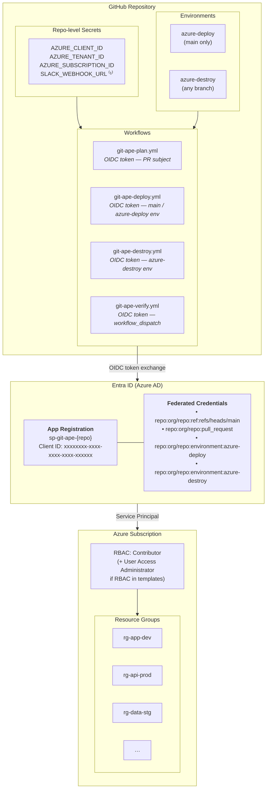
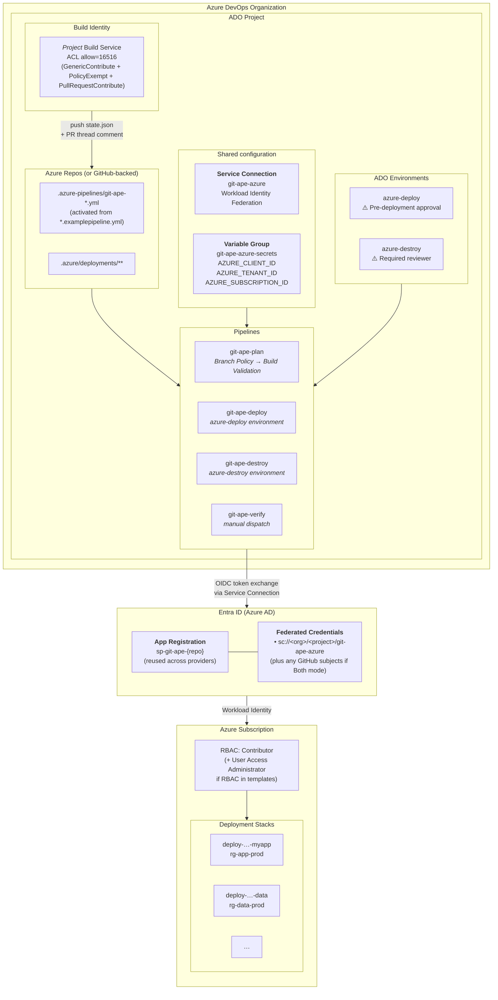

# Git-Ape Onboarding Guide

:::warning
EXPERIMENTAL ONLY: This onboarding flow is provided for testing and evaluation.
Do **not** use Git-Ape in production environments.
Validate all generated configuration manually before any real deployment.
:::
Set up a repository to use Git-Ape's CI/CD pipelines for Azure deployments. This guide covers Entra ID (Azure AD) configuration, OIDC federation, RBAC, and repository setup for both **GitHub Actions** and **Azure DevOps Pipelines**.

## Choosing your CI/CD provider

Git-Ape supports two CI/CD providers behind a single onboarding entry point. Pick the one that matches where your repository and pipelines already live.

| Provider | Repository host | Pipelines location | Approval gate | Auth |
|----------|-----------------|--------------------|---------------|------|
| **GitHub Actions** | GitHub | `.github/workflows/git-ape-*.yml` | PR review + `/deploy` comment | OIDC federated identity (`azure/login@v2`) |
| **Azure DevOps Pipelines** | Azure Repos or GitHub | `.azure-pipelines/git-ape-*.yml` | ADO Environment pre-deployment approval | Workload identity federation service connection |

Select the provider during onboarding via the `cicd` parameter on `/git-ape-onboarding` (`github`, `ado`, or `both`). Both providers reuse the same Entra ID App Registration, so you can switch later or run both side-by-side without re-creating identities.

:::note
ADO mode replaces the GitHub-specific `/deploy` PR-comment trigger with an ADO Environment approval check; SARIF upload (GitHub Advanced Security) is not available in ADO mode and is replaced with a pipeline-artifact verification report.
:::

Git-Ape supports two onboarding modes:

| Mode | Use case | GitHub Environments | Secrets scope |
|------|----------|-------------------|---------------|
| **Single environment** | One Azure subscription for all deployments | `azure-deploy`, `azure-destroy` | Repository-level |
| **Multi-environment** | Separate subscriptions per stage (dev/staging/prod) | `azure-deploy-dev`, `azure-deploy-staging`, `azure-deploy-prod`, `azure-destroy` | Environment-level |

## Quick Start (Automated)

You can run onboarding from Copilot Chat with:

```text
@Git-Ape Onboarding onboard this repository
```

or directly invoke the skill:

```text
/git-ape-onboarding
```

Both paths execute the same onboarding playbook through Copilot Chat.

The skill-driven onboarding flow will gather or use:
1. **GitHub repository URL** — e.g. `https://github.com/your-org/your-repo`
2. **Entra ID App Registration name** — e.g. `sp-git-ape-your-repo`
3. **Single or multi-environment mode** — choose whether to deploy to one or multiple Azure subscriptions
4. **Azure subscription(s)** — defaults to your current `az` subscription
5. **RBAC role(s)** — Contributor (default) or Contributor + User Access Administrator

### Parameterized Usage

**Single environment:**

```text
/git-ape-onboarding onboard https://github.com/your-org/your-repo on subscription 00000000-0000-0000-0000-000000000000 with Contributor
```

**Multi-environment:**

```text
/git-ape-onboarding onboard https://github.com/your-org/your-repo with dev on 11111111-1111-1111-1111-111111111111 as Contributor, staging on 22222222-2222-2222-2222-222222222222 as Contributor, prod on 33333333-3333-3333-3333-333333333333 as Contributor+UserAccessAdministrator
```

Each multi-environment entry creates:
- A GitHub environment `azure-deploy-{name}` with environment-level secrets
- A federated credential scoped to that environment
- An RBAC role assignment on the specified subscription

---

## Manual Setup

If you prefer to inspect or execute each component manually, follow the steps below.

### Prerequisites

> **Tip:** Run `/prereq-check` in Copilot Chat to automatically validate all tools and auth sessions.

| Tool | Minimum Version | Purpose |
|------|-----------------|---------|
| Azure CLI (`az`) | 2.50+ | Azure resource management, RBAC, OIDC |
| GitHub CLI (`gh`) | 2.0+ | Repo secrets, environments, OIDC detection |
| jq | 1.6+ | JSON parsing in scripts and workflows |
| git | any | Version control (usually pre-installed) |

**Install (pick your platform):**

<details><summary>macOS (Homebrew)</summary>

```bash
brew install azure-cli gh jq
```
</details>

<details><summary>Ubuntu / Debian</summary>

```bash
# Azure CLI
curl -sL https://aka.ms/InstallAzureCLIDeb | sudo bash

# GitHub CLI
(type -p wget >/dev/null || sudo apt-get install wget -y) \
  && sudo mkdir -p -m 755 /etc/apt/keyrings \
  && out=$(mktemp) && wget -nv -O"$out" https://cli.github.com/packages/githubcli-archive-keyring.gpg \
  && cat "$out" | sudo tee /etc/apt/keyrings/githubcli-archive-keyring.gpg > /dev/null \
  && sudo chmod go+r /etc/apt/keyrings/githubcli-archive-keyring.gpg \
  && echo "deb [arch=$(dpkg --print-architecture) signed-by=/etc/apt/keyrings/githubcli-archive-keyring.gpg] https://cli.github.com/packages stable main" | sudo tee /etc/apt/sources.list.d/github-cli.list > /dev/null \
  && sudo apt-get update && sudo apt-get install gh -y

# jq
sudo apt-get install -y jq
```
</details>

<details><summary>Windows (PowerShell)</summary>

```powershell
winget install Microsoft.AzureCLI
winget install GitHub.cli
winget install jqlang.jq
```

> **Note:** Git-Ape commands require a Bash shell. Install [Git for Windows](https://gitforwindows.org/) and use Git Bash.
</details>

You must be logged in to both:
```bash
az login           # Azure — needs Owner or User Access Administrator on the subscription(s)
gh auth login      # GitHub — needs admin access to the target repository
```

### Step 1: Create an Entra ID App Registration

This creates the identity that GitHub Actions will use to authenticate with Azure.

```bash
# Choose a name for your app registration
SP_NAME="sp-git-ape-your-repo"

# Create the app registration
CLIENT_ID=$(az ad app create --display-name "$SP_NAME" --query appId -o tsv)
echo "Client ID: $CLIENT_ID"

# Create the service principal
az ad sp create --id "$CLIENT_ID"

# Note your tenant ID
TENANT_ID=$(az account show --query tenantId -o tsv)
echo "Tenant ID: $TENANT_ID"
```

### Step 2: Configure OIDC Federated Credentials

OIDC eliminates stored secrets by letting GitHub Actions exchange a short-lived token for Azure access at runtime. The number of federated credentials depends on your mode.

```bash
# Get the app object ID (different from client ID)
OBJECT_ID=$(az ad app show --id "$CLIENT_ID" --query id -o tsv)

# Your GitHub repo (org/repo format)
REPO="your-org/your-repo"

# Detect whether the GitHub org uses default or customized OIDC subjects
USE_DEFAULT_SUBJECT=$(gh api "orgs/${REPO%%/*}/actions/oidc/customization/sub" --jq '.use_default' 2>/dev/null || echo true)

if [[ "$USE_DEFAULT_SUBJECT" == "false" ]]; then
  REPO_ID=$(gh api "repos/$REPO" --jq '.id')
  OWNER_ID=$(gh api "repos/$REPO" --jq '.owner.id')
  OIDC_PREFIX="repository_owner_id:${OWNER_ID}:repository_id:${REPO_ID}"
else
  OIDC_PREFIX="repo:$REPO"
fi
```

Use `$OIDC_PREFIX` for all subjects below. On orgs with a customized subject template, `repo:org/repo:...` will fail with `AADSTS700213`.

#### 2a. Main Branch (merge-triggered deployments)

```bash
az ad app federated-credential create --id "$OBJECT_ID" --parameters '{
  "name": "fc-main-branch",
  "issuer": "https://token.actions.githubusercontent.com",
  "subject": "'"$OIDC_PREFIX"':ref:refs/heads/main",
  "description": "Main branch deployments",
  "audiences": ["api://AzureADTokenExchange"]
}'
```

#### 2b. Pull Requests (plan validation)

```bash
az ad app federated-credential create --id "$OBJECT_ID" --parameters '{
  "name": "fc-pull-request",
  "issuer": "https://token.actions.githubusercontent.com",
  "subject": "'"$OIDC_PREFIX"':pull_request",
  "description": "Pull request validation",
  "audiences": ["api://AzureADTokenExchange"]
}'
```

#### 2c. Deploy Environment(s)

<details>
<summary><strong>Single environment mode</strong></summary>

Create one federated credential for the `azure-deploy` environment:

```bash
az ad app federated-credential create --id "$OBJECT_ID" --parameters '{
  "name": "fc-env-deploy",
  "issuer": "https://token.actions.githubusercontent.com",
  "subject": "'"$OIDC_PREFIX"':environment:azure-deploy",
  "description": "Deploy environment",
  "audiences": ["api://AzureADTokenExchange"]
}'
```

</details>

<details>
<summary><strong>Multi-environment mode</strong></summary>

Create one federated credential per environment. Each maps to a separate GitHub environment:

```bash
# Dev environment
az ad app federated-credential create --id "$OBJECT_ID" --parameters '{
  "name": "fc-env-deploy-dev",
  "issuer": "https://token.actions.githubusercontent.com",
  "subject": "'"$OIDC_PREFIX"':environment:azure-deploy-dev",
  "description": "Deploy environment (dev)",
  "audiences": ["api://AzureADTokenExchange"]
}'

# Staging environment
az ad app federated-credential create --id "$OBJECT_ID" --parameters '{
  "name": "fc-env-deploy-staging",
  "issuer": "https://token.actions.githubusercontent.com",
  "subject": "'"$OIDC_PREFIX"':environment:azure-deploy-staging",
  "description": "Deploy environment (staging)",
  "audiences": ["api://AzureADTokenExchange"]
}'

# Production environment
az ad app federated-credential create --id "$OBJECT_ID" --parameters '{
  "name": "fc-env-deploy-prod",
  "issuer": "https://token.actions.githubusercontent.com",
  "subject": "'"$OIDC_PREFIX"':environment:azure-deploy-prod",
  "description": "Deploy environment (prod)",
  "audiences": ["api://AzureADTokenExchange"]
}'
```

</details>

#### 2d. Destroy Environment (shared across all modes)

```bash
az ad app federated-credential create --id "$OBJECT_ID" --parameters '{
  "name": "fc-env-destroy",
  "issuer": "https://token.actions.githubusercontent.com",
  "subject": "'"$OIDC_PREFIX"':environment:azure-destroy",
  "description": "Destroy environment",
  "audiences": ["api://AzureADTokenExchange"]
}'
```

#### Verify Credentials

```bash
az ad app federated-credential list --id "$OBJECT_ID" --query "[].{name:name, subject:subject}" -o table
```

**Single environment** — expected 4 credentials:
```
Name               Subject
-----------------  -----------------------------------------------
fc-main-branch     <OIDC_PREFIX>:ref:refs/heads/main
fc-pull-request    <OIDC_PREFIX>:pull_request
fc-env-deploy      <OIDC_PREFIX>:environment:azure-deploy
fc-env-destroy     <OIDC_PREFIX>:environment:azure-destroy
```

**Multi-environment (3 envs)** — expected 6 credentials:
```
Name                    Subject
----------------------  ---------------------------------------------------
fc-main-branch          <OIDC_PREFIX>:ref:refs/heads/main
fc-pull-request         <OIDC_PREFIX>:pull_request
fc-env-deploy-dev       <OIDC_PREFIX>:environment:azure-deploy-dev
fc-env-deploy-staging   <OIDC_PREFIX>:environment:azure-deploy-staging
fc-env-deploy-prod      <OIDC_PREFIX>:environment:azure-deploy-prod
fc-env-destroy          <OIDC_PREFIX>:environment:azure-destroy
```

### Step 3: Assign RBAC Roles

Grant the service principal permissions on your Azure subscription(s).

#### Single Environment

```bash
SUBSCRIPTION_ID=$(az account show --query id -o tsv)
SP_OBJECT_ID=$(az ad sp show --id "$CLIENT_ID" --query id -o tsv)

# Contributor — create, modify, and delete resources
az role assignment create \
  --assignee-object-id "$SP_OBJECT_ID" \
  --assignee-principal-type ServicePrincipal \
  --role "Contributor" \
  --scope "/subscriptions/$SUBSCRIPTION_ID"
```

If your templates include RBAC role assignments (e.g., managed identity access to storage), also add:

```bash
# User Access Administrator — manage role assignments
az role assignment create \
  --assignee-object-id "$SP_OBJECT_ID" \
  --assignee-principal-type ServicePrincipal \
  --role "User Access Administrator" \
  --scope "/subscriptions/$SUBSCRIPTION_ID"
```

#### Multi-Environment

Assign roles on each target subscription. Each environment can have a different role if needed:

```bash
SP_OBJECT_ID=$(az ad sp show --id "$CLIENT_ID" --query id -o tsv)

# Dev — Contributor only
az role assignment create \
  --assignee-object-id "$SP_OBJECT_ID" \
  --assignee-principal-type ServicePrincipal \
  --role "Contributor" \
  --scope "/subscriptions/$DEV_SUBSCRIPTION_ID"

# Staging — Contributor only
az role assignment create \
  --assignee-object-id "$SP_OBJECT_ID" \
  --assignee-principal-type ServicePrincipal \
  --role "Contributor" \
  --scope "/subscriptions/$STAGING_SUBSCRIPTION_ID"

# Production — Contributor + User Access Administrator
az role assignment create \
  --assignee-object-id "$SP_OBJECT_ID" \
  --assignee-principal-type ServicePrincipal \
  --role "Contributor" \
  --scope "/subscriptions/$PROD_SUBSCRIPTION_ID"

az role assignment create \
  --assignee-object-id "$SP_OBJECT_ID" \
  --assignee-principal-type ServicePrincipal \
  --role "User Access Administrator" \
  --scope "/subscriptions/$PROD_SUBSCRIPTION_ID"
```

> **Note:** If multiple environments share the same subscription, you only need one set of role assignments for that subscription.

#### Verify RBAC

```bash
az role assignment list --assignee "$SP_OBJECT_ID" --query "[].{role:roleDefinitionName, scope:scope}" -o table
```

### Step 4: Configure GitHub Repository

#### 4a. Set GitHub Secrets

These are **identifiers**, not credentials — OIDC means no actual secrets are stored.

<details>
<summary><strong>Single environment mode</strong></summary>

Set secrets at the **repository level** (shared by all workflows):

```bash
REPO="your-org/your-repo"

echo "$CLIENT_ID" | gh secret set AZURE_CLIENT_ID -R "$REPO"
echo "$TENANT_ID" | gh secret set AZURE_TENANT_ID -R "$REPO"
echo "$SUBSCRIPTION_ID" | gh secret set AZURE_SUBSCRIPTION_ID -R "$REPO"
```

</details>

<details>
<summary><strong>Multi-environment mode</strong></summary>

Set shared secrets at the **repository level**, then set the subscription per **environment**:

```bash
REPO="your-org/your-repo"

# Repo-level secrets (shared)
echo "$CLIENT_ID" | gh secret set AZURE_CLIENT_ID -R "$REPO"
echo "$TENANT_ID" | gh secret set AZURE_TENANT_ID -R "$REPO"

# Per-environment secrets
# Dev
gh secret set AZURE_CLIENT_ID --repo "$REPO" --env "azure-deploy-dev" --body "$CLIENT_ID"
gh secret set AZURE_TENANT_ID --repo "$REPO" --env "azure-deploy-dev" --body "$TENANT_ID"
gh secret set AZURE_SUBSCRIPTION_ID --repo "$REPO" --env "azure-deploy-dev" --body "$DEV_SUBSCRIPTION_ID"

# Staging
gh secret set AZURE_CLIENT_ID --repo "$REPO" --env "azure-deploy-staging" --body "$CLIENT_ID"
gh secret set AZURE_TENANT_ID --repo "$REPO" --env "azure-deploy-staging" --body "$TENANT_ID"
gh secret set AZURE_SUBSCRIPTION_ID --repo "$REPO" --env "azure-deploy-staging" --body "$STAGING_SUBSCRIPTION_ID"

# Production
gh secret set AZURE_CLIENT_ID --repo "$REPO" --env "azure-deploy-prod" --body "$CLIENT_ID"
gh secret set AZURE_TENANT_ID --repo "$REPO" --env "azure-deploy-prod" --body "$TENANT_ID"
gh secret set AZURE_SUBSCRIPTION_ID --repo "$REPO" --env "azure-deploy-prod" --body "$PROD_SUBSCRIPTION_ID"

# Destroy environment (uses first subscription as default)
gh secret set AZURE_CLIENT_ID --repo "$REPO" --env "azure-destroy" --body "$CLIENT_ID"
gh secret set AZURE_TENANT_ID --repo "$REPO" --env "azure-destroy" --body "$TENANT_ID"
gh secret set AZURE_SUBSCRIPTION_ID --repo "$REPO" --env "azure-destroy" --body "$DEV_SUBSCRIPTION_ID"
```

> **Tip:** Environment-level secrets override repo-level secrets. By setting `AZURE_CLIENT_ID` and `AZURE_TENANT_ID` at the environment level, you can later switch to separate app registrations per environment without modifying workflows.

</details>

#### 4b. Create GitHub Environments

<details>
<summary><strong>Single environment mode</strong></summary>

**azure-deploy** — for deployment jobs:

```bash
# Create environment with branch policy (main only)
gh api -X PUT "repos/$REPO/environments/azure-deploy" --input - <<'EOF'
{
  "deployment_branch_policy": {
    "protected_branches": false,
    "custom_branch_policies": true
  }
}
EOF

# Allow main branch
gh api -X POST "repos/$REPO/environments/azure-deploy/deployment-branch-policies" --input - <<'EOF'
{
  "name": "main",
  "type": "branch"
}
EOF
```

</details>

<details>
<summary><strong>Multi-environment mode</strong></summary>

Create one environment per deployment target:

```bash
for ENV_NAME in dev staging prod; do
  # Create environment with branch policy (main only)
  gh api -X PUT "repos/$REPO/environments/azure-deploy-${ENV_NAME}" --input - <<'EOF'
{
  "deployment_branch_policy": {
    "protected_branches": false,
    "custom_branch_policies": true
  }
}
EOF

  # Allow main branch
  gh api -X POST "repos/$REPO/environments/azure-deploy-${ENV_NAME}/deployment-branch-policies" --input - <<'EOF'
{
  "name": "main",
  "type": "branch"
}
EOF
done
```

</details>

**azure-destroy** — for destroy jobs (same for both modes):

```bash
gh api -X PUT "repos/$REPO/environments/azure-destroy" --input - <<'EOF'
{
  "deployment_branch_policy": null
}
EOF
```

#### 4c. (Optional) Required Reviewers

For production deployments, add required reviewers to the deploy environment:

1. Go to **Settings → Environments → azure-deploy** (or **azure-deploy-prod** in multi-env mode)
2. Check **Required reviewers**
3. Add team members who should approve deployments

In multi-environment mode, you might want:
- `azure-deploy-dev` — no reviewer required (fast iteration)
- `azure-deploy-staging` — optional reviewer
- `azure-deploy-prod` — required reviewer (gate for production)

### Step 5: Copy Git-Ape Workflows

#### 5a. GitHub Actions (provider: `github` or `both`)

Copy the workflow files to your repository:

```bash
# Clone the git-ape repo if you haven't
git clone https://github.com/your-org/git-ape.git /tmp/git-ape

# Copy workflows to your repo
cp /tmp/git-ape/.github/workflows/git-ape-*.yml your-repo/.github/workflows/

# Commit and push
cd your-repo
git add .github/workflows/
git commit -m "feat: add Git-Ape deployment workflows"
git push
```

The following workflows will be added:

| Workflow | Trigger | Purpose |
|----------|---------|---------|
| `git-ape-plan.yml` | PR with template changes | Validate, security scan, what-if, cost estimate |
| `git-ape-deploy.yml` | Merge to main or `/deploy` comment | Execute ARM deployment |
| `git-ape-destroy.yml` | Merge PR with `destroy-requested` status | Delete resource group |
| `git-ape-verify.yml` | Manual dispatch | Verify OIDC, RBAC, and pipeline health |

> **Note:** Drift detection and TTL-based cleanup are being replaced by agentic workflows — coming soon.

#### 5b. Azure DevOps Pipelines (provider: `ado` or `both`)

The four ADO pipeline files ship as **`*.examplepipeline.yml`** templates with two placeholder tokens. Substitute the tokens, rename to `*.yml`, then register each pipeline. The same shared `templates/` and `scripts/` directories are used by both providers and ship ready-to-use.

**Inputs** — set these to match the resources you created in earlier steps:

| Variable | Example | Created in |
|----------|---------|------------|
| `ADO_ORG_URL` | `https://dev.azure.com/contoso` | Step 1 (Azure DevOps org) |
| `ADO_PROJECT` | `myapp-infra` | Step 1 |
| `ADO_REPO_NAME` | `myapp-infra` | Step 1 |
| `ADO_REPO_TYPE` | `tfsgit` (Azure Repos) or `github` (GitHub-backed) | Step 1 |
| `ADO_CONNECTION_NAME` | `git-ape-azure` | Workload identity federation service connection (created in OIDC steps) |
| `ADO_VARIABLE_GROUP` | `git-ape-azure-secrets` | Variable group with `AZURE_CLIENT_ID`, `AZURE_TENANT_ID`, `AZURE_SUBSCRIPTION_ID` |

**Activate (substitute placeholders + rename):**

```bash
# Copy the ADO pipelines into your repo
cp -r /tmp/git-ape/.azure-pipelines your-repo/.azure-pipelines

cd your-repo/.azure-pipelines
for f in *.examplepipeline.yml; do
  target="${f%.examplepipeline.yml}.yml"
  sed -e "s|{{SERVICE_CONNECTION_NAME}}|$ADO_CONNECTION_NAME|g" \
      -e "s|{{VARIABLE_GROUP_NAME}}|$ADO_VARIABLE_GROUP|g" \
      "$f" > "$target"
  echo "Activated: $f -> $target"
done
cd -

# Verify no placeholders remain (should print nothing)
grep -rE '\{\{(SERVICE_CONNECTION_NAME|VARIABLE_GROUP_NAME)\}\}' \
  your-repo/.azure-pipelines/*.yml && echo "ERROR: placeholders not fully substituted"

# Commit the activated pipelines
cd your-repo
git add .azure-pipelines/
git commit -m "feat: add Git-Ape Azure DevOps pipelines"
git push
```

**Register each pipeline with ADO:**

```bash
for name in git-ape-plan git-ape-deploy git-ape-destroy git-ape-verify; do
  az pipelines create \
    --name "$name" \
    --yaml-path ".azure-pipelines/${name}.yml" \
    --org "$ADO_ORG_URL" --project "$ADO_PROJECT" \
    --repository "$ADO_REPO_NAME" \
    --repository-type "$ADO_REPO_TYPE" \
    --branch main \
    --skip-first-run true
done
```

For GitHub-backed repos (Both mode), also pass `--service-connection <github-service-connection>`.

The following pipelines will be registered:

| Pipeline | Trigger | Purpose |
|----------|---------|---------|
| `git-ape-plan.yml` | Branch Policy Build Validation on PR | Validate, IaC scans, what-if, post PR thread comment |
| `git-ape-deploy.yml` | Merge to main + `azure-deploy` environment approval | `az stack sub create` (parallel), integration tests, commit `state.json` |
| `git-ape-destroy.yml` | Merge to main when `metadata.json.status = destroy-requested` | `az stack sub delete --action-on-unmanage deleteAll` + soft-delete sweep |
| `git-ape-verify.yml` | Manual dispatch | OIDC + RBAC + cross-host tooling check |

After registration:

1. **Branch Policy → Build Validation** — required for the plan pipeline to trigger on PRs (Azure Repos silently ignores YAML `pr:` triggers). The `git-ape-onboarding-azdo` sub-skill creates this; if you're doing it by hand, use `az repos policy build create`.
2. **Build identity Git permissions** — the deploy/destroy pipelines push `state.json` back to `main`. Grant the build identity ACL `allow=16516` (= `GenericContribute (4) + PolicyExempt (128) + PullRequestContribute (16384)`) on the repo. Without this, deploy succeeds but the state commit fails with `TF402455` and the plan PR comment never appears (silent 403 from the threads API).
3. **Environment approvals** — create the `azure-deploy` and `azure-destroy` ADO environments and add a pre-deployment approval check on each. ADO's environment approval replaces the GitHub-specific `/deploy` PR-comment trigger.

> **Tip:** All of the above (substitution, registration, branch policy, ACL grant, environment creation) is automated by `/git-ape-onboarding` with `cicd: ado` or `cicd: both`. The manual steps above are for inspection / repair.

### Step 6: Verify Setup

Create a test deployment to verify the pipeline works:

```bash
# Create a minimal test template
mkdir -p .azure/deployments/deploy-test

cat > .azure/deployments/deploy-test/template.json <<'EOF'
{
  "$schema": "https://schema.management.azure.com/schemas/2018-05-01/subscriptionDeploymentTemplate.json#",
  "contentVersion": "1.0.0.0",
  "parameters": {
    "location": { "type": "string", "defaultValue": "eastus" }
  },
  "resources": []
}
EOF

cat > .azure/deployments/deploy-test/parameters.json <<'EOF'
{
  "$schema": "https://schema.management.azure.com/schemas/2019-04-01/deploymentParameters.json#",
  "contentVersion": "1.0.0.0",
  "parameters": {
    "location": { "value": "eastus" }
  }
}
EOF

# Open a PR
git checkout -b test/git-ape-onboarding
git add .azure/deployments/deploy-test/
git commit -m "test: verify git-ape pipeline"
git push -u origin test/git-ape-onboarding
gh pr create --title "Test: Git-Ape onboarding" --body "Verify the OIDC pipeline works end-to-end."
```

**GitHub Actions:** if the PR triggers the `Git-Ape: Plan` workflow and it succeeds, your GitHub setup is complete.

**Azure DevOps Pipelines:** if the PR triggers the `git-ape-plan` pipeline (via Branch Policy → Build Validation) and it posts a plan thread comment on the PR, your ADO setup is complete. You can also run the `git-ape-verify` pipeline manually (`az pipelines run --name git-ape-verify`) to confirm OIDC, RBAC, and cross-host tooling without opening a PR.

---

## Optional: Slack Notifications

To get Slack notifications on deploy/destroy/drift events:

1. Create a Slack Incoming Webhook: [Slack API → Incoming Webhooks](https://api.slack.com/messaging/webhooks)
2. Set the secret:
   ```bash
   echo "https://hooks.slack.com/services/T.../B.../..." | gh secret set SLACK_WEBHOOK_URL -R "$REPO"
   ```

---

## Troubleshooting

### "AADSTS700016: Application not found"

The federated credential subject doesn't match the workflow's token. Verify:
```bash
az ad app federated-credential list --id "$OBJECT_ID" -o table
```

Common issues:
- Repository name is case-sensitive in the `subject` field
- `pull_request` subject is needed for PR-triggered workflows
- `environment:azure-deploy` subject is needed for jobs using `environment: azure-deploy`

### "AuthorizationFailed" during deployment

The service principal lacks permissions. Check assignments:
```bash
az role assignment list --assignee "$SP_OBJECT_ID" -o table
```

Ensure **Contributor** role is assigned at the subscription scope.

### "Resource group not found" in plan workflow

The OIDC token exchange succeeded but the subscription doesn't match. Verify:
```bash
# Check which subscription the service principal can access
az account list --query "[?tenantId=='$TENANT_ID']" -o table
```

### GitHub environment not created

Environment creation requires admin access to the repository. Ask a repo admin to create the `azure-deploy` and `azure-destroy` environments manually via **Settings → Environments**.

### "TF400813: The user is not authorized to access this resource" or "Service connection authorization failed" (Azure DevOps mode)

The pipeline's service connection cannot reach Azure. Diagnose in this order:

1. **Verify workload identity federation is set up correctly.** Note: the federated subject and issuer that ADO actually presents to Entra ID are NOT the conventional `sc://<org>/<project>/<connection>` and `https://vstoken.dev.azure.com/...` documented in older guides. Read back the live values from the service connection endpoint after creation:
   ```bash
   ADO_TOKEN=$(az account get-access-token --resource 499b84ac-1321-427f-aa17-267ca6975798 --query accessToken -o tsv)
   curl -sS -H "Authorization: Bearer $ADO_TOKEN" \
     "https://dev.azure.com/$ORG/$PROJECT/_apis/serviceendpoint/endpoints/$SC_ID?api-version=7.1" \
     | jq '{issuer: .authorization.parameters.workloadIdentityFederationIssuer,
            subject: .authorization.parameters.workloadIdentityFederationSubject}'
   ```
   Then update the federated credential on the App Registration to match exactly.
2. **Confirm the service connection is authorized for the pipeline.** In ADO, open **Project Settings → Service connections → \{name\} → Security** and grant access to the pipeline (or check "Grant access permission to all pipelines").
3. **Check RBAC** on the Azure subscription with `az role assignment list --assignee "$CLIENT_ID" -o table` — the same role assignments power both providers.

### "TF402455: Pushes to this branch are not permitted" on state.json commit (Azure DevOps mode)

The deploy/destroy pipelines push `state.json` back to `main` after a successful run. With the **Branch Policy → Build Validation** required check active (created during onboarding), the build identity needs the `PolicyExempt` permission to push. The onboarding skill grants three Git permissions in one ACL call: `GenericContribute (4) + PolicyExempt (128) + PullRequestContribute (16384) = allow=16516`. If state commits started failing after a branch policy was added later, re-run the ACL grant — see the `git-ape-onboarding-azdo` sub-skill, Step B.

### Plan PR comment never appears (Azure DevOps mode)

The pipeline succeeds but the PR thread comment is missing. Common causes:

- **Build identity is missing `PullRequestContribute` (bit 16384).** The threads API silently 403s. Run the Step B ACL grant again — the orchestrator's call to `git-ape-onboarding-azdo` covers this, but if you onboarded before that step existed, re-run it.
- **`$(System.AccessToken)` not mapped to env var.** ADO macros in inline bash scripts evaluate as shell command substitution, not macro expansion. Always declare `env: SYSTEM_ACCESSTOKEN: $(System.AccessToken)` on the task and reference `$SYSTEM_ACCESSTOKEN` in bash. Git-Ape's pipelines do this; if you've copied a step into a custom workflow, preserve the env mapping.

### Plan pipeline doesn't trigger when a PR is opened (Azure DevOps mode)

**Azure Repos silently ignores the YAML `pr:` trigger block.** PR builds are queued by **Branch Policy → Build Validation**, which the onboarding skill creates against the plan pipeline. Without the policy, opening a PR will not run plan. Verify with:

```bash
az repos policy list --org "$ADO_ORG_URL" --project "$ADO_PROJECT" --branch main \
  --query "[?settings.displayName=='Git-Ape Plan']" -o table
```

If empty, re-run the `git-ape-onboarding-azdo` sub-skill Step C (or invoke the orchestrator with `cicd: ado`).

### Multi-deployment PRs run sequentially even with multiple agents (Azure DevOps mode)

ADO free-tier orgs have **only 1 self-hosted parallel job** org-wide. Even if you run 5 agents, only one runs a job at a time and matrix slots serialize. The verify pipeline surfaces this as a `⚠️ PERFORMANCE NOTE`. Options:

- Buy `Self-hosted CI/CD` parallel jobs at $15/job/mo (Azure DevOps → Organization Settings → Billing).
- Make the project public — public projects get unlimited self-hosted parallelism.

Once unlocked, set `strategy.matrix.maxParallel: 5` in `git-ape-plan.yml` (already configured) and matrix slots run on different agents simultaneously.

---

## Deployment Stacks

Git-Ape uses **[Azure Deployment Stacks](https://learn.microsoft.com/azure/azure-resource-manager/bicep/deployment-stacks)** as the deployment primitive instead of `az deployment sub create`. Per [Azure/git-ape#30](https://github.com/Azure/git-ape/issues/30), this provides **idempotent destroy** for multi-RG and multi-scope deployments — `az group delete` alone leaves orphans.

| Pipeline | Deployment Stack action |
|---|---|
| Plan | `az stack sub validate` for validation; `az deployment sub what-if` for preview (independent of stack lifecycle) |
| Deploy | `az stack sub create --name <id> --action-on-unmanage deleteAll --deny-settings-mode none --yes` |
| Destroy | `az stack sub delete --name <id> --action-on-unmanage deleteAll --yes` (handles every resource the stack manages, across resource groups and scopes) |

The stack name equals the deployment ID (e.g. `deploy-20260218-143022-myapp`). After a successful deploy, `state.json` records:

```json
{
  "deployMethod": "stack",
  "stackId": "/subscriptions/.../providers/Microsoft.Resources/deploymentStacks/<id>",
  "resourceGroups": ["rg-..."],
  "managedResources": [{ "id": "...", "status": "managed" }]
}
```

The destroy pipeline reads `state.json`, calls `az stack sub delete`, then runs a **soft-delete sweep** for resources that survive resource-group deletion (Key Vault, Log Analytics, Cognitive Services, App Configuration, Recovery Services, API Management). Vaults without `enablePurgeProtection` are auto-purged; protected vaults are recorded in `state.retainedSoftDeleted[]` with their `scheduledPurgeDate` so the user knows when the name becomes available again.

If a state.json predates Deployment Stacks (`deployMethod` field absent or set to `legacy`), destroy falls back to `az group delete` for the recorded `resourceGroup`.

---

## Architecture

### Single Environment Mode



⁽¹⁾ Optional

### Multi-Environment Mode

```mermaid
flowchart TB
    subgraph GH["GitHub Repository"]
        direction TB
        subgraph RepoSecrets["Repo-level Secrets"]
            R1["AZURE_CLIENT_ID<br/>AZURE_TENANT_ID"]
        end
        subgraph EnvSecrets["Environment Secrets"]
            ED["<b>azure-deploy-dev</b><br/>AZURE_CLIENT_ID, AZURE_TENANT_ID<br/>AZURE_SUBSCRIPTION_ID → Dev Sub"]
            ES["<b>azure-deploy-staging</b><br/>AZURE_CLIENT_ID, AZURE_TENANT_ID<br/>AZURE_SUBSCRIPTION_ID → Staging Sub"]
            EP["<b>azure-deploy-prod</b><br/>AZURE_CLIENT_ID, AZURE_TENANT_ID<br/>AZURE_SUBSCRIPTION_ID → Prod Sub<br/>⚠️ Required reviewers"]
            EX["<b>azure-destroy</b><br/>AZURE_CLIENT_ID, AZURE_TENANT_ID<br/>AZURE_SUBSCRIPTION_ID → Default Sub"]
        end
    end

    subgraph Entra["Entra ID (Azure AD)"]
        AR2["<b>App Registration</b><br/>sp-git-ape-{repo}"]
        FC2["<b>Federated Credentials</b><br/>• repo:org/repo:ref:refs/heads/main<br/>• repo:org/repo:pull_request<br/>• repo:org/repo:environment:azure-deploy-dev<br/>• repo:org/repo:environment:azure-deploy-staging<br/>• repo:org/repo:environment:azure-deploy-prod<br/>• repo:org/repo:environment:azure-destroy"]
        AR2 --- FC2
    end

    subgraph Subs["Azure Subscriptions"]
        direction LR
        DEV["<b>Dev Sub</b><br/>RBAC: Contributor<br/>rg-*-dev"]
        STG["<b>Staging Sub</b><br/>RBAC: Contributor<br/>rg-*-stg"]
        PRD["<b>Prod Sub</b><br/>RBAC: Contributor + UAA<br/>rg-*-prod"]
    end

    GH -->|OIDC token exchange| Entra
    Entra -->|Service Principal<br/>(shared)| DEV
    Entra -->|Service Principal<br/>(shared)| STG
    Entra -->|Service Principal<br/>(shared)| PRD
```

### Azure DevOps Pipelines Mode

Same Entra ID app registration, different fronting CI provider. The federated credential subject is `sc://<org>/<project>/<service-connection>` instead of GitHub's `repo:<org>/<repo>:...`.



**ADO-specific footnotes:**

- The PR-trigger comes from a **Branch Policy → Build Validation** check; ADO's YAML `pr:` block is silently ignored on Azure Repos, so the policy is what actually queues the plan pipeline on a PR.
- Approval gates live on **ADO Environments** (`azure-deploy`, `azure-destroy`), replacing GitHub's `/deploy` PR-comment trigger.
- The build identity needs three Git permissions in one ACL grant (`allow=16516`) to push `state.json` back and post the plan PR thread comment.
- In **Both** mode, the same App Registration carries federated credentials for *both* providers — the `sc://...` subject for ADO and the `repo:...` subjects for GitHub Actions.

---

## Security Considerations

| Aspect | Implementation |
|--------|---------------|
| **No stored secrets** | OIDC federated identity — no client secrets or certificates |
| **Scoped access** | Federated credentials are scoped per repo + branch/environment |
| **Least privilege** | Only Contributor role by default; add UAA only if needed |
| **Environment gates** | Deploy environments restricted to `main` branch; reviewers optional |
| **Destructive protection** | `azure-destroy` environment can require manual approval |
| **Subscription isolation** | Multi-env mode targets separate subscriptions per stage |
| **Audit trail** | All deployments logged in `state.json` with actor, timestamp, run URL |

### Multi-Environment Security Best Practices

When using multi-environment mode:

1. **Required reviewers on production** — Always add reviewers to `azure-deploy-prod`
2. **Separate subscriptions** — Use distinct subscriptions for dev, staging, and prod to enforce blast radius isolation
3. **Graduated RBAC** — Use minimal roles in dev (Contributor) and additional roles in prod only when needed
4. **Environment variables for config** — Use GitHub environment variables (not secrets) for non-sensitive environment-specific values like region or resource name prefixes
5. **Deployment promotion** — Deploy to dev first, then staging, then prod — never skip stages

### Using Environments in Workflows

With multi-environment mode, update your deploy workflow to select the correct environment:

```yaml
# In git-ape-deploy.yml, change the environment field to be dynamic:
deploy:
  environment: azure-deploy-${{ steps.params.outputs.environment }}
  # This resolves to azure-deploy-dev, azure-deploy-staging, or azure-deploy-prod
  # based on the "environment" parameter in parameters.json
```

The `environment` parameter in your `parameters.json` determines which GitHub environment (and therefore which Azure subscription) is used:

```json
{
  "parameters": {
    "environment": { "value": "prod" },
    "location": { "value": "eastus" },
    "project": { "value": "myapp" }
  }
}
```
