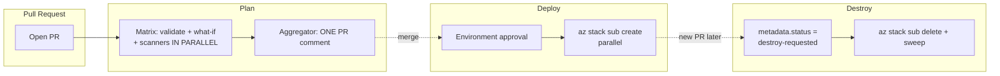

# Pipeline Architecture Overview

Git-Ape ships the same four-pipeline lifecycle (plan → deploy → destroy + verify) on **two providers**. This page is the orientation map; per-provider deep dives sit alongside.

| Provider | Reference page |
|---|---|
| **Azure DevOps Pipelines** | [`azure-devops-pipelines`](./azure-devops-pipelines) |
| **GitHub Actions** | [`github-actions-workflows`](./github-actions-workflows) |

If you only operate one provider, you can skip the other.

## What's shared

Both providers run **bit-for-bit identical bash logic** for the parts that matter: rendering the PR comment, computing the destroy plan, summarising scan results.

```
.azure-pipelines/scripts/        ← shared by ADO AND GitHub Actions
├── render-pr-comment.sh         ← per-deployment Markdown body
├── render-summary.sh            ← per-deployment summary JSON
└── render-destroy-plan.sh       ← stack-aware deletion plan
```

The bash is portable and pure stdout — testable locally:

```bash
bash .azure-pipelines/scripts/render-pr-comment.sh \
  deploy-20260218-143022-myapp \
  deploy \
  /tmp/staging
```

## What's intentionally different

| Concern | GitHub Actions | Azure DevOps Pipelines |
|---|---|---|
| Trigger | Native `on: pull_request` | Branch Policy → Build Validation (YAML `pr:` is silently ignored) |
| Approval | Environment + optional `/deploy` comment | Environment pre-deployment approval |
| OIDC | `azure/login@v2` | `AzureCLI@2` with workload identity federation |
| Matrix syntax | `strategy.matrix` over JSON list (`max-parallel`) | `strategy.matrix: $[ <runtime expr> ]` over object (`maxParallel`) |
| PR comment API | `gh api` / `actions/github-script` | `curl` to threads API |
| State commit-back | `GITHUB_TOKEN` (`contents: write`) | `$(System.AccessToken)` (build identity, ACL `allow=16516`) |
| Tool install | `actions/setup-python@v5`, populated tool cache | `bootstrap-prereqs.yml` template (apt/brew/choco) |
| SARIF | Native GitHub Code Scanning | Pipeline artifact only |

## Common patterns

Same shape both sides, different syntax:

1. **Two-stage layout: Detect → Plan/Deploy/Destroy.** Detect runs once, fans out via matrix.
2. **Matrix parallelism.** Multi-deployment PRs run concurrently, capped at 5.
3. **Bash subshells for further parallelism.** IaC scanners + `az stack sub create` calls run as `& wait`.
4. **File-based status passing.** Status words written to artifact files, not consumed via output variables. Survives skipped-task expansion failures.
5. **Aggregator job for ONE consolidated PR comment.** Each matrix slot writes per-deployment artifacts; a single aggregator job downloads everything and posts one comment with summary table + collapsibles.
6. **Idempotent PR comment update via marker** (`<!-- git-ape-plan -->`). PATCH if exists, POST otherwise.
7. **State commit-back with `[skip ci]`** to prevent trigger loops.

## Lifecycle



## Where next

- User-facing day-to-day flow: [`workflows/overview`](../workflows/overview)
- Deploy primitive: [`deployment-stacks`](./deployment-stacks)
- State file schema: [`deployment/state`](../deployment/state)
- Failure modes + fixes: [`troubleshooting`](./troubleshooting)
