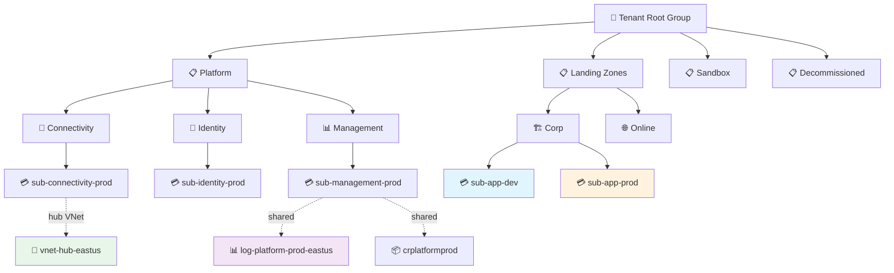

<!-- AUTO-GENERATED — DO NOT EDIT. Source: .github/skills/azure-landing-zone-discovery/SKILL.md -->


# Azure Landing Zone Discovery

> Auto-discover enterprise Azure landing zone topology — management groups, platform vs. application subscriptions, policy assignments, hub-spoke networking, and shared services — and write .azure/landing-zone-context.json. USE FOR: discovering the landing zone, mapping management groups, choosing a target subscription, connecting to a hub VNet or shared services, or manually injecting context for air-gapped/cross-tenant tenants. NOT FOR: deploying individual resources, CAF name lookups, or per-template policy compliance checks.

## Details

| Property | Value |
|----------|-------|
| **Skill Directory** | `.github/skills/azure-landing-zone-discovery/` |
| **Phase** | General |
| **User Invocable** | ✅ Yes |
| **Usage** | `/azure-landing-zone-discovery Discovery scope or manual injection mode (e.g. 'full discovery', 'inject context', 'check policies for eastus')` |


## Documentation

# Azure Landing Zone Discovery

## Overview

Discover the enterprise Azure landing zone topology from the current Azure context, enabling Git-Ape to make landing zone-aware deployment decisions — routing workloads to the correct subscription, connecting to shared services, and avoiding policy conflicts.

Enterprise Azure environments follow the [Cloud Adoption Framework landing zone architecture](https://learn.microsoft.com/azure/cloud-adoption-framework/ready/landing-zone/) with management groups, platform subscriptions, application landing zones, and hub-spoke networking.

**Triggers:**

- User asks: "discover landing zone", "show management groups", "what policies apply?"
- Before first deployment in a new subscription (auto-detect enterprise topology)
- User asks: "connect to hub VNet", "use shared Log Analytics", "which subscription for prod?"
- User provides manual landing zone context for air-gapped or cross-tenant environments

**Do NOT use for:**

- Deploying or configuring individual resources → use `git-ape` / the deployment agents
- CAF abbreviation or resource-name lookups → use `/azure-naming-research`
- Policy compliance checks on a specific ARM template → use `/azure-policy-advisor`
- Security analysis of a template or resource → use `/azure-security-analyzer`
- Viewing or visualizing live resources in one resource group → use `/azure-resource-visualizer`

This skill is about **tenant/landing-zone topology**, not single-resource actions.

**Output:**

- `.azure/landing-zone-context.json` — Machine-readable landing zone topology
- Landing zone summary displayed to user with management group hierarchy visualization

## Procedure

### 1. Check for Existing Context

Before running discovery, check if a landing zone context already exists:

```bash
LZ_CONTEXT_FILE=".azure/landing-zone-context.json"

if [[ -f "$LZ_CONTEXT_FILE" ]]; then
  DISCOVERED_AT=$(jq -r '.discoveredAt' "$LZ_CONTEXT_FILE")
  echo "Existing landing zone context found (discovered: $DISCOVERED_AT)"
  echo ""
  echo "Options:"
  echo "  A. Use existing context"
  echo "  B. Re-run discovery (refresh)"
  echo "  C. Manually update context"
fi
```

### 2. Run Full Discovery

Run the discovery script to auto-detect the landing zone topology. The skill ships parity implementations for both shells — use the bash script on Linux/macOS and the PowerShell script on Windows (both produce an identical `landing-zone-context.json`):

```bash
# Bash (Linux/macOS, git-bash on Windows)
.github/skills/azure-landing-zone-discovery/scripts/discover-lz.sh \
  --output-format json \
  --output-file .azure/landing-zone-context.json
```

```powershell
# PowerShell (Windows, or pwsh on any platform)
.github/skills/azure-landing-zone-discovery/scripts/discover-lz.ps1 `
  -OutputFormat json `
  -OutputFile .azure/landing-zone-context.json
```

**Discovery targets:**

| Target | Azure CLI Command | Fallback |
|--------|------------------|----------|
| Management group hierarchy | `az account management-group list` | Subscription-only mode |
| Subscription classification | Tags, naming convention, management group placement | Manual classification |
| Policy assignments | `az policy assignment list --scope <mg-or-sub>` | Skip policy check |
| Network topology | `az network vnet list`, peerings, DNS zones | Manual VNet ID input |
| Shared services | Resource Graph query for Log Analytics, ACR, Key Vault | Manual resource IDs |
| RBAC | `az role assignment list` | Note limited permissions |

**The script handles these scenarios gracefully:**

- **No management groups (flat subscription):** Skips hierarchy discovery, uses subscription-level context only
- **Limited RBAC (no management group read):** Falls back to subscription-level discovery, prompts for manual hierarchy input
- **Cross-tenant landing zone:** Manual injection required — discovery limited to current tenant
- **No network resources:** Skips networking discovery, notes that hub connectivity is not configured

### 3. Management Group Hierarchy Discovery

```bash
# Discover management group tree
MG_LIST=$(az account management-group list --output json 2>/dev/null)

if [[ $? -ne 0 ]] || [[ -z "$MG_LIST" ]] || [[ "$MG_LIST" == "[]" ]]; then
  echo "⚠️ Cannot read management groups (insufficient RBAC or flat subscription)"
  echo "Falling back to subscription-level discovery"
  # Continue with subscription-only mode
fi
```

**Classification heuristics:**

- Management groups named `*platform*`, `*connectivity*`, `*identity*`, `*management*` → Platform
- Management groups named `*landing*zone*`, `*workload*`, `*application*`, `*corp*`, `*online*` → Landing Zones
- Management groups named `*sandbox*`, `*decommission*` → Non-production
- Tags `mg-type`, `lz-type` override naming heuristics

### 4. Subscription Classification

Classify subscriptions as platform or application landing zones:

```bash
# List all accessible subscriptions
SUBSCRIPTIONS=$(az account list --query "[?state=='Enabled']" --output json)

# For each subscription, determine its role
for SUB in $(echo "$SUBSCRIPTIONS" | jq -r '.[].id'); do
  SUB_NAME=$(echo "$SUBSCRIPTIONS" | jq -r --arg id "$SUB" '.[] | select(.id == $id) | .name')

  # Check management group placement
  MG_PATH=$(az account management-group subscription show \
    --subscription-id "$SUB" \
    --query "managementGroupAncestorsChain[].displayName" \
    --output tsv 2>/dev/null || echo "unknown")

  # Classify by naming convention and MG placement
  case "$SUB_NAME" in
    *connectivity*|*network*|*hub*)
      ROLE="connectivity" ;;
    *identity*|*aad*)
      ROLE="identity" ;;
    *management*|*logging*|*monitor*)
      ROLE="management" ;;
    *sandbox*|*dev*|*test*)
      ROLE="landing-zone-dev" ;;
    *staging*|*uat*|*qa*)
      ROLE="landing-zone-staging" ;;
    *prod*|*production*)
      ROLE="landing-zone-prod" ;;
    *)
      ROLE="landing-zone" ;;
  esac
done
```

### 5. Policy Conflict Detection

Discover policy assignments that may affect deployments:

```bash
# Get policy assignments at management group and subscription level
POLICY_ASSIGNMENTS=$(az policy assignment list \
  --scope "/subscriptions/$SUBSCRIPTION_ID" \
  --query "[?enforcementMode=='Default']" \
  --output json)

# Identify high-risk policies (Deny effect)
DENY_POLICIES=$(echo "$POLICY_ASSIGNMENTS" | jq '[
  .[] | select(.parameters != null) |
  {
    name: .displayName,
    scope: .scope,
    effect: (
      .parameters.effect.value //
      .parameters.Effect.value //
      "unknown"
    ),
    policyDefinitionId: .policyDefinitionId
  } | select(.effect == "Deny" or .effect == "deny")
]')

# Check for common deployment-blocking policies
# - Deny-Public-IP
# - Allowed-Locations
# - Deny-Storage-Public-Access
# - Require-Tag
```

**Policy conflict categories:**

| Policy | Impact | Deployment Concern |
|--------|--------|--------------------|
| Deny-Public-IP | Blocks public IP creation | Use private endpoints or internal load balancers |
| Allowed-Locations | Restricts regions | Template must use allowed regions only |
| Deny-Storage-Public-Access | Blocks public storage | Require private endpoints for storage |
| Require-Tag | Blocks untagged resources | Ensure all resources have required tags |
| Deny-Subnet-Without-NSG | Blocks subnets without NSGs | Include NSG in template |

### 6. Network Topology Discovery

Discover hub-spoke networking configuration:

```bash
# Find hub VNets (typically in connectivity subscription)
HUB_VNETS=$(az graph query -q "
  Resources
  | where type == 'microsoft.network/virtualnetworks'
  | where name contains 'hub' or tags['network-role'] == 'hub'
  | project id, name, location, subscriptionId,
    addressPrefixes=properties.addressSpace.addressPrefixes
" --output json 2>/dev/null)

# Find VNet peerings
PEERINGS=$(az graph query -q "
  Resources
  | where type == 'microsoft.network/virtualnetworks'
  | mv-expand peering=properties.virtualNetworkPeerings
  | project vnetName=name, peerName=peering.name,
    remoteVnet=peering.properties.remoteVirtualNetwork.id,
    peeringState=peering.properties.peeringState
" --output json 2>/dev/null)

# Find private DNS zones
DNS_ZONES=$(az graph query -q "
  Resources
  | where type == 'microsoft.network/privatednszones'
  | project id, name, subscriptionId
" --output json 2>/dev/null)
```

### 7. Shared Services Discovery

Discover shared infrastructure for workload integration:

```bash
# Find shared Log Analytics workspaces
LOG_ANALYTICS=$(az graph query -q "
  Resources
  | where type == 'microsoft.operationalinsights/workspaces'
  | where tags['shared'] == 'true' or name contains 'platform' or name contains 'central'
  | project id, name, subscriptionId, location,
    sku=properties.sku.name, retentionDays=properties.retentionInDays
" --output json 2>/dev/null)

# Find shared Container Registries
ACR=$(az graph query -q "
  Resources
  | where type == 'microsoft.containerregistry/registries'
  | where tags['shared'] == 'true' or sku.name == 'Premium'
  | project id, name, subscriptionId, location, sku=sku.name,
    loginServer=properties.loginServer
" --output json 2>/dev/null)

# Find shared Key Vaults
KEY_VAULTS=$(az graph query -q "
  Resources
  | where type == 'microsoft.keyvault/vaults'
  | where tags['shared'] == 'true' or name contains 'platform'
  | project id, name, subscriptionId, location
" --output json 2>/dev/null)
```

### 8. Generate Landing Zone Context File

The discovery script assembles every section above — management-group hierarchy, subscription classification, networking topology, policy partitions, shared services, and the `landingZoneDetection` confidence block — into a single `.azure/landing-zone-context.json`. No manual assembly is needed.

After discovery completes, **summarize the result back to the user**, explicitly covering: the management-group hierarchy, which subscriptions are platform vs. application landing zones, the network topology (hub-spoke vs. flat) and any hub VNet to peer, the policy constraints found (deny effects, allowed locations, required tags), the shared services available, and the detection `confidence`. If discovery was blocked by limited RBAC or a cross-tenant boundary, say so and point the user to the manual-injection path below.

```bash
# Inspect the assembled context
jq '.' .azure/landing-zone-context.json
```

**Output format (`landing-zone-context.json`):**

Notable field semantics:

- `landingZoneDetection` rates how confidently the discovered topology matches the canonical [Azure Landing Zone accelerator](https://azure.github.io/Azure-Landing-Zones/accelerator/) reference. Treat `confidence` as the primary signal — see the confidence model below.
- `networking.topology` is one of `"hub-spoke"` (hub VNet discovered), `"flat"` (discovery ran, no hub found), or `"unknown"` (discovery skipped or failed). See the Edge Cases table below.
- `policies.denyEffects[]` contains only assignments whose `effect` parameter resolves to `Deny`. `DeployIfNotExists`, `Modify`, and initiatives are excluded — see the Policy effect classification table below.
- `policies.alzCanonicalAssignments[]` lists policy assignments whose name matches a known ALZ accelerator policy (e.g. `Deploy-MDFC-Config`, `Deny-PublicIP`). High-precision ALZ signature regardless of `effect`.

```json
{
  "discoveredAt": "2026-04-30T10:00:00Z",
  "discoveryMethod": "auto",
  "landingZoneDetection": {
    "isLandingZone": true,
    "confidence": "high",
    "confidenceScore": 85,
    "reference": "https://azure.github.io/Azure-Landing-Zones/accelerator/",
    "matchedSignals": [
      { "signal": "alz-top-level-mgs", "points": 30, "evidence": "4/4 canonical top-level MGs (Platform, Landing zones, Sandbox, Decommissioned)" },
      { "signal": "platform-children", "points": 20, "evidence": "3/3 platform children (Connectivity, Identity, Management)" },
      { "signal": "alz-lz-archetypes", "points": 10, "evidence": "Corp and Online MGs present under Landing zones" },
      { "signal": "platform-subscriptions", "points": 10, "evidence": "3 platform subscription(s) classified" },
      { "signal": "hub-spoke-topology", "points": 5, "evidence": "Hub VNet(s): vnet-hub-eastus" },
      { "signal": "hub-in-connectivity-sub", "points": 5, "evidence": "Hub VNet sits in a connectivity-classified subscription" },
      { "signal": "alz-canonical-policies", "points": 5, "evidence": "1 canonical ALZ policy assignment(s): Deploy-MDFC-Config" }
    ],
    "missingSignals": [],
    "checks": {
      "topLevelMgs": { "platform": true, "landingZones": true, "sandbox": true, "decommissioned": true },
      "platformChildren": { "connectivity": true, "identity": true, "management": true },
      "lzChildren": { "corp": true, "online": true },
      "platformSubscriptionCount": 3,
      "hubSpoke": true,
      "hubInConnectivitySubscription": true,
      "knownAlzPolicies": ["Deploy-MDFC-Config"]
    }
  },
  "managementGroups": {
    "root": "Tenant Root Group",
    "hierarchy": [
      {
        "id": "/providers/Microsoft.Management/managementGroups/mg-platform",
        "displayName": "Platform",
        "role": "platform",
        "children": ["mg-connectivity", "mg-identity", "mg-management"]
      },
      {
        "id": "/providers/Microsoft.Management/managementGroups/mg-landing-zones",
        "displayName": "Landing Zones",
        "role": "landing-zones",
        "children": ["mg-corp", "mg-online"]
      }
    ]
  },
  "subscriptions": {
    "platform": [
      { "id": "...", "name": "sub-connectivity-prod", "role": "connectivity", "mgPath": "mg-platform/mg-connectivity" },
      { "id": "...", "name": "sub-identity-prod", "role": "identity", "mgPath": "mg-platform/mg-identity" },
      { "id": "...", "name": "sub-management-prod", "role": "management", "mgPath": "mg-platform/mg-management" }
    ],
    "landingZones": [
      { "id": "...", "name": "sub-app-dev", "environment": "dev", "mgPath": "mg-landing-zones/mg-corp" },
      { "id": "...", "name": "sub-app-prod", "environment": "prod", "mgPath": "mg-landing-zones/mg-corp" }
    ]
  },
  "sharedServices": {
    "logAnalytics": { "id": "...", "name": "log-platform-prod-eastus", "subscription": "sub-management-prod", "location": "eastus" },
    "containerRegistry": { "id": "...", "name": "crplatformprod", "subscription": "sub-management-prod", "location": "eastus" },
    "keyVault": { "id": "...", "name": "kv-platform-prod-eus", "subscription": "sub-management-prod", "location": "eastus" }
  },
  "networking": {
    "topology": "hub-spoke",
    "hubs": [
      { "id": "...", "name": "vnet-hub-eastus", "subscription": "sub-connectivity-prod", "location": "eastus", "addressPrefixes": ["10.0.0.0/16"] }
    ],
    "privateDnsZones": [
      "privatelink.blob.core.windows.net",
      "privatelink.vaultcore.azure.net",
      "privatelink.azurewebsites.net"
    ],
    "peerings": []
  },
  "policies": {
    "denyEffects": [
      { "name": "Deny-Public-IP", "scope": "/providers/Microsoft.Management/managementGroups/mg-landing-zones", "impact": "Blocks public IP creation in landing zone subscriptions" }
    ],
    "auditEffects": [],
    "allowedLocations": ["eastus", "westus2", "westeurope"],
    "requiredTags": ["Environment", "Project", "CostCenter"],
    "alzCanonicalAssignments": ["Deploy-MDFC-Config", "Deploy-Diag-LogsCat-LAW"]
  },
  "currentIdentity": {
    "user": "user@contoso.com",
    "tenantId": "...",
    "roles": []
  }
}
```

### 9. Landing Zone Visualization

Generate a Mermaid diagram of the management group hierarchy:

````markdown
## Landing Zone Topology


````

## Landing Zone Detection Confidence

Discovery rates every tenant against the canonical [Azure Landing Zone (ALZ) accelerator](https://azure.github.io/Azure-Landing-Zones/accelerator/) reference and emits a `landingZoneDetection` block in the context file. The score (0–100) drives downstream tooling decisions: trust the auto-classified MGs/subscriptions vs. fall back to manual injection or user confirmation.

### Weighted Signals

| Signal | Max points | Source |
|---|---:|---|
| `alz-top-level-mgs` — `Platform`, `Landing zones`, `Sandbox`, `Decommissioned` | 30 | Management group hierarchy |
| `platform-children` — `Connectivity`, `Identity`, `Management` under Platform | 20 | Management group hierarchy |
| `alz-lz-archetypes` — both `Corp` and `Online` under Landing zones | 10 | Management group hierarchy |
| `platform-subscriptions` — subs classified as connectivity/identity/management/platform-other | 10 | Subscription role classification |
| `hub-spoke-topology` — at least one hub VNet discovered | 5 | Network topology |
| `hub-in-connectivity-sub` — hub VNet lives in a connectivity subscription | 5 | Network + subscription cross-check |
| `alz-canonical-policies` — assignments matching ALZ accelerator policy names (e.g. `Deploy-MDFC-Config`, `Deny-PublicIP`) | 15 (3 × 5) | Policy assignments |

Top-level and platform-children signals scale: 4/4 top-level MGs = 30, 3/4 = 20, 2/4 = 10; 3/3 platform children = 20, 2/3 = 10; ≥3 platform subs = 10, ≥1 = 5; ALZ canonical policy points = `min(matches × 5, 15)`.

### Confidence Buckets

| `confidence` | Score range | `isLandingZone` | Suggested treatment |
|---|---:|---:|---|
| `high` | ≥ 70 | `true` | Trust auto-classification. Proceed with hub-attach + shared services without prompting. |
| `medium` | 40–69 | `true` | Surface matched + missing signals to the user. Ask to confirm before assuming the tenant is ALZ-managed. |
| `low` | 10–39 | `false` | Treat as standalone tenant. Mention partial signals so the user can decide whether to manually inject. |
| `none` | < 10 | `false` | No ALZ signature. Default to flat-tenant assumptions. Recommend manual injection only if the user knows the tenant *is* ALZ-managed. |

Inspect the full breakdown:

```bash
jq '.landingZoneDetection' .azure/landing-zone-context.json
```

`matchedSignals[]` records every signal that scored, including the points awarded and a human-readable evidence string. `missingSignals[]` lists the signals that scored zero — useful for telling the user *why* confidence is low. `checks` exposes the raw booleans/counts the scorer evaluated.

## Manual Injection

When discovery cannot reach the landing zone (cross-tenant, limited RBAC, air-gapped environments), users can inject context manually. **Always drive this through the `inject-lz.sh` (or `inject-lz.ps1`) script with its canonical flags — `--hub-vnet-id`, `--log-analytics-id`, `--acr-id`, `--allowed-locations`, `--required-tags` — rather than hand-writing the JSON**, so the schema and `discoveryMethod` stay correct (Option B). Fall back to editing the file directly (Option A) or the interactive questionnaire (Option C) only when the script cannot be run.

Manual injection is an explicit assertion that the tenant *is* landing-zone managed, so the script writes a `landingZoneDetection` block with `source: "manual"` and `confidence: high` by default (the auto-scorer is bypassed — there is nothing to score when discovery couldn't run). Control this with `--confidence <high|medium|low|none>`, or use `--not-landing-zone` to assert the opposite. When combined with `--merge`, an explicit `--confidence` overrides the stored detection; without it, injection only ever *raises* confidence, never silently downgrades a real discovery result.

### Option A: Provide the Context File Directly

Create or edit `.azure/landing-zone-context.json` with your landing zone topology. Set `"discoveryMethod": "manual"`.

### Option B: Use the Injection Script

The injection script ships in both shells (bash and PowerShell parity ports). Both write an identical `landing-zone-context.json`:

```bash
# Bash (Linux/macOS, git-bash on Windows)
.github/skills/azure-landing-zone-discovery/scripts/inject-lz.sh \
  --hub-vnet-id "/subscriptions/.../resourceGroups/.../providers/Microsoft.Network/virtualNetworks/vnet-hub" \
  --log-analytics-id "/subscriptions/.../resourceGroups/.../providers/Microsoft.OperationalInsights/workspaces/log-central" \
  --acr-id "/subscriptions/.../resourceGroups/.../providers/Microsoft.ContainerRegistry/registries/crshared" \
  --allowed-locations "eastus,westus2" \
  --required-tags "Environment,Project,CostCenter"
```

```powershell
# PowerShell (Windows, or pwsh on any platform)
.github/skills/azure-landing-zone-discovery/scripts/inject-lz.ps1 `
  -HubVnetId "/subscriptions/.../resourceGroups/.../providers/Microsoft.Network/virtualNetworks/vnet-hub" `
  -LogAnalyticsId "/subscriptions/.../resourceGroups/.../providers/Microsoft.OperationalInsights/workspaces/log-central" `
  -AcrId "/subscriptions/.../resourceGroups/.../providers/Microsoft.ContainerRegistry/registries/crshared" `
  -AllowedLocations "eastus,westus2" `
  -RequiredTags "Environment,Project,CostCenter"
```

To simply assert "I know my tenant is ALZ-managed" when discovery scored too low (or could not run) — without supplying topology — call the script with a confidence flag only:

```bash
# Assert landing-zone managed (writes confidence: high, source: manual)
.github/skills/azure-landing-zone-discovery/scripts/inject-lz.sh --confidence high

# Merge an asserted hub onto an existing low-confidence discovery and raise it
.github/skills/azure-landing-zone-discovery/scripts/inject-lz.sh --merge --confidence high \
  --hub-vnet-id "/subscriptions/.../providers/Microsoft.Network/virtualNetworks/vnet-hub"
```

### Option C: Interactive Questionnaire

When invoked without arguments, the agent asks targeted questions:

```markdown
I'll help you set up your landing zone context. Please answer what you can:

1. **Management Groups:** What management group should workloads land in?
   - Provide the management group name or ID, or type "none" for flat subscription

2. **Hub Networking:** Do you have a hub VNet to peer with?
   - Provide the hub VNet resource ID, or type "none"

3. **Shared Log Analytics:** Which Log Analytics workspace should resources send diagnostics to?
   - Provide the workspace resource ID, or type "none"

4. **Shared Container Registry:** Do you have a shared ACR for container workloads?
   - Provide the ACR resource ID, or type "none"

5. **Azure Policies:** Are there Azure Policies at the management group level that restrict:
   - Public IPs? (yes/no)
   - Allowed regions? (list regions, or "any")
   - Required tags? (list tag names, or "none")
   - Public storage access? (yes/no)

6. **Landing Zone Subscriptions:** List your subscriptions by environment:
   - Dev: subscription ID or name
   - Staging: subscription ID or name
   - Prod: subscription ID or name
```

## Integration with Deployment Workflow

### Stage 1: Requirements Gathering (Landing Zone-Aware)

When landing zone context is available:

- **Auto-select target subscription:** Route `dev` deployments to dev landing zone, `prod` to prod landing zone
- **Warn on platform subscriptions:** If user targets a platform subscription (connectivity/identity/management), warn that it's not for workloads
- **Show policy constraints:** Display Deny-effect policies that may affect the deployment before template generation

### Stage 2: Template Generation (Landing Zone-Aware)

When landing zone context is available:

- **Auto-connect diagnostics:** Route `diagnosticSettings` to the shared Log Analytics workspace
- **Hub VNet peering:** Generate VNet peering to the hub VNet for workloads that need network connectivity
- **Private endpoints:** Use discovered private DNS zones for private endpoint DNS integration
- **Container Registry:** Reference shared ACR for container workloads instead of creating a new one
- **Policy-compliant defaults:** Use allowed locations, apply required tags, avoid public IPs if denied

### Stage 2.5: Security Gate (Landing Zone-Aware)

- **Policy validation:** Check if the deployment template would be denied by management group policies
- **Flag conflicts:** Warn if template uses resources/configurations blocked by landing zone policies
- **Suggest alternatives:** Recommend policy-compliant configurations (e.g., private endpoints instead of public IPs)

## Edge Cases

| Scenario | Handling | `networking.topology` |
|----------|----------|------------------------|
| Hub VNet found (named/tagged `hub`) | Record hubs and peerings | `hub-spoke` |
| Network discovery ran, no hub found | Treat as single-VNet / non-enterprise environment | `flat` |
| Network discovery skipped (`--skip-network`) or failed | Downstream must not assume any topology | `unknown` |
| No management groups (flat subscription) | Skip hierarchy discovery, use subscription-level context only | (independent of topology field) |
| Cross-tenant landing zone (CSP, MCA) | Manual injection required — discovery limited to current tenant | (set by `inject-lz.sh`) |
| Limited RBAC (no management group read) | Fall back to subscription-level discovery + manual injection for hierarchy | (network may still run) |
| Multiple landing zones for same environment | Present options, let user choose | (independent) |
| Landing zone not yet deployed | Guide user to ALZ accelerator or suggest manual setup | `flat` |
| `landingZoneDetection.confidence` is `low` or `none` | Treat tenant as standalone; do not auto-attach to hub/shared services. If user knows it *is* ALZ-managed, fall back to manual injection | (preserved from discovery) |
| `landingZoneDetection.confidence` is `medium` | Surface `matchedSignals` and `missingSignals` to the user; ask to confirm ALZ-managed behavior before relying on auto-classification | (preserved from discovery) |
| Stale context (old discovery) | Warn if context is older than 7 days, offer refresh | (preserved from prior run) |
| No Azure Resource Graph access | Fall back to individual `az` CLI queries (slower, current-subscription only) | `hub-spoke` or `flat` |

### Policy effect classification

`discover-lz.sh` reads `parameters.effect.value` (or `Effect.value`) from each assignment and partitions the result:

| Effect parameter (case-insensitive) | Goes into |
|-------------------------------------|-----------|
| `Deny` | `policies.denyEffects[]` |
| `Audit`, `AuditIfNotExists` | `policies.auditEffects[]` |
| `DeployIfNotExists`, `Modify`, `Append`, `Disabled` | excluded from both arrays |
| Initiatives (`policySetDefinitions/*`) with no top-level effect param | excluded — effect varies by inner definition |
| Missing or unrecognized effect param | excluded |

Downstream consumers (Stage 2.5 Security Gate, Stage 1 warnings) should treat `denyEffects` as deployment-blocking and `auditEffects` as informational.

## Best Practices

1. **Run discovery at onboarding time** — Include in the `/git-ape-onboarding` flow
2. **Refresh periodically** — Re-run discovery if the context is older than 7 days
3. **Commit context to repo** — `.azure/landing-zone-context.json` should be version-controlled for team consistency
4. **Use tags for classification** — Tag management groups and subscriptions with `lz-role`, `environment`, `shared=true` for reliable discovery
5. **Review policy conflicts early** — Check policies before template generation, not at deploy time

## Related Skills

- `/azure-policy-advisor` — Detailed policy compliance assessment for ARM templates
- `/azure-security-analyzer` — Security best practices analysis
- `/azure-resource-visualizer` — Live resource group visualization
- `/azure-drift-detector` — Configuration drift detection
- `/prereq-check` — Verify Azure CLI and authentication prerequisites
