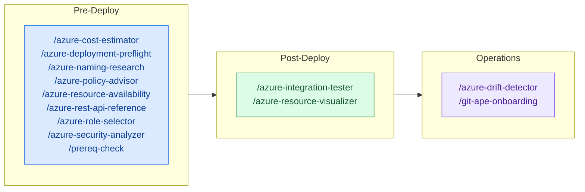

<!-- AUTO-GENERATED — DO NOT EDIT. Source: .github/skills/ -->

# Skills Overview

Skills are focused capabilities invoked by agents at specific stages of the deployment workflow. Each skill handles one task.

> 📇 See the [Skill Registry](./registry) for the full machine-readable catalog (first-party + community) with author and maturity metadata.

## Pre-Deploy Skills

| Skill | Description | Invocable |
|-------|-------------|:---------:|
| [Azure Cost Estimator](./azure-cost-estimator) | Estimate monthly costs for Azure resources by querying the Azure Retail Prices API. Parses ARM templates to identify resources, SKUs, and regions, then looks up real retail pricing. Produces a per-resource cost breakdown with monthly totals. Use during template generation or when user asks about costs. | ✅ |
| [Azure Deployment Preflight](./azure-deployment-preflight) | Run preflight validation on ARM templates before deployment. Performs what-if analysis, permission checks, and generates a structured report with resource changes (create/modify/delete). Use before any deployment to preview changes and catch issues early. | ✅ |
| [Azure Naming Research](./azure-naming-research) | Research Azure naming constraints and CAF abbreviations for a given resource type. Use when you need to look up the official CAF slug, naming rules (length, scope, valid characters), and derive validation/cleaning regex patterns for an Azure resource. Triggers on: CAF abbreviation lookup, Azure naming rules research, resource naming constraints. | ✅ |
| [Azure Policy Advisor](./azure-policy-advisor) | Assess ARM template resources for Azure Policy compliance. Analyse the template, query existing subscription assignments via `az policy assignment list`, identify unassigned built-in and custom policies (CIS, NIST, FedRAMP), and emit a two-part report: template-fixable gaps (Part 1) and subscription-level policy assignments (Part 2). USE FOR: recommending Azure Policy assignments for an ARM template, auditing a subscription against CIS/NIST/general best practices, deciding which initiatives to assign at sub or management-group scope, distinguishing template-fixable vs platform-level governance gaps. DO NOT USE FOR: per-resource security configuration assessment (use azure-security-analyzer), RBAC role recommendations (use azure-role-selector), CAF naming abbreviations (use azure-naming-research), or pricing estimates (use azure-cost-estimator). INVOKES: az policy assignment list, az policy set-definition list, microsoft_docs_search, microsoft_docs_fetch. | ✅ |
| [Azure Resource Availability](./azure-resource-availability) | Query live Azure APIs to validate resource availability before template generation or deployment. Checks VM SKU restrictions, Kubernetes/runtime version support, API version compatibility, and subscription quota. Use during requirements gathering and preflight to catch deployment failures early. | ✅ |
| [Azure Rest Api Reference](./azure-rest-api-reference) | Look up Azure REST API and ARM template reference documentation for any resource type. Returns exact property schemas, required fields, valid values, and latest stable API versions. Use BEFORE generating or modifying ARM templates to ensure correctness. No Azure connection required. | ✅ |
| [Azure Role Selector](./azure-role-selector) | Recommend least-privilege Azure RBAC roles for deployed resources. Finds minimal built-in roles matching desired permissions or creates custom role definitions. Use during security analysis or when configuring access for service principals and managed identities. | ✅ |
| [Azure Security Analyzer](./azure-security-analyzer) | Analyze Azure resource configurations against security best practices using Azure MCP bestpractices service. Produces per-resource security assessment with severity ratings and recommendations. Use during template generation before deployment confirmation. | ✅ |
| [Prereq Check](./prereq-check) | Validate Git-Ape CLI tool installation (az, gh, jq, git), versions, and auth sessions. Shows platform-specific install commands for anything missing. USE FOR: check Git-Ape prerequisites, what do I need to install for Git-Ape, verify Git-Ape CLI tools, az: command not found, gh: command not found, jq: command not found, git: command not found, az missing, gh missing, jq missing, git missing, fresh machine setup for Git-Ape, dev container setup for Git-Ape, before running git-ape-onboarding, az login required, gh auth login, auth expired, not logged in, outdated az version, minimum az version, upgrade az. DO NOT USE FOR: Anything else. This skill is narrowly scoped to prerequisites checks for Git-Ape's CLI tools and auth sessions. Do not use it for any other purpose. | ✅ |

## Post-Deploy Skills

| Skill | Description | Invocable |
|-------|-------------|:---------:|
| [Azure Integration Tester](./azure-integration-tester) | Run post-deployment integration tests for Azure resources. Verify Function Apps, Storage Accounts, Databases, App Services are healthy and accessible. Use after successful Azure deployment. | ✅ |
| [Azure Resource Visualizer](./azure-resource-visualizer) | Analyze deployed Azure resource groups and generate detailed Mermaid architecture diagrams showing relationships between resources. Use for post-deployment visualization, understanding existing infrastructure, or documenting live Azure environments. | ✅ |

## Operations Skills

| Skill | Description | Invocable |
|-------|-------------|:---------:|
| [Azure Drift Detector](./azure-drift-detector) | Detect configuration drift between deployed Azure resources and stored deployment state. Compare actual Azure configuration against desired state in .azure/deployments/, identify differences, and guide user through reconciliation options. Use when checking for manual changes, policy remediations, or unauthorized modifications. | ✅ |
| [Git Ape Onboarding](./git-ape-onboarding) | Bootstrap a GitHub repository for Git-Ape CI/CD: Entra app registration, OIDC federated credentials, RBAC role assignments, GitHub environments (azure-deploy/azure-destroy), required secrets, and scaffold Actions workflow files — plus enterprise-wide distribution via a `.github-private` repo (managed-settings.json plugin standards + custom agents). USE FOR: first-time Git-Ape setup, new subscription onboarding, multi-environment (dev/staging/prod) setup, configure OIDC, federated credentials, RBAC setup, GitHub environments, scaffold workflow files, rolling Git-Ape out org/enterprise-wide. DO NOT USE FOR: deploying resources (use git-ape), drift detection alone, secret rotation. | ✅ |

## General Skills

| Skill | Description | Invocable |
|-------|-------------|:---------:|
| [Azure Stack Deploy](./azure-stack-deploy) | Run an Azure Deployment Stack create (subscription scope) for a prepared Git-Ape deployment artifact and write state.json (schemaVersion 1.0). Use locally so the result matches the CI deploy workflow. | ✅ |
| [Azure Stack Destroy](./azure-stack-destroy) | Tear down a Git-Ape deployment by ID. Reads `state.json` under `.azure/deployments/<id>/` to delete the Azure Deployment Stack and purge soft-deleted Key Vault / Cognitive Services. Refuses to run without `state.json`. Use for any local CLI or VS Code Git-Ape teardown so the result matches the CI destroy workflow. | ✅ |

## Community Skills

Third-party skills contributed under `.github/skills/community/`. These are **not** maintained by the Git-Ape maintainers — see each skill's Author for provenance.

| Skill | Description | Author | Maturity | Invocable |
|-------|-------------|--------|----------|:---------:|
| [Aws Api Gateway](./community/aws-api-gateway) | AWS API Gateway for REST and HTTP API management. Use when creating APIs, configuring integrations, setting up authorization, managing stages, implementing rate limiting, or troubleshooting API issues. | dawright22 | stable | ✅ |
| [Aws Bedrock](./community/aws-bedrock) | AWS Bedrock foundation models for generative AI. Use when invoking foundation models, building AI applications, creating embeddings, configuring model access, or implementing RAG patterns. | dawright22 | stable | ✅ |
| [Aws Cloudformation](./community/aws-cloudformation) | AWS CloudFormation infrastructure as code for stack management. Use when writing templates, deploying stacks, managing drift, troubleshooting deployments, or organizing infrastructure with nested stacks. | dawright22 | stable | ✅ |
| [Aws Cloudwatch](./community/aws-cloudwatch) | AWS CloudWatch monitoring for logs, metrics, alarms, and dashboards. Use when setting up monitoring, creating alarms, querying logs with Insights, configuring metric filters, building dashboards, or troubleshooting application issues. | dawright22 | stable | ✅ |
| [Aws Cognito](./community/aws-cognito) | AWS Cognito user authentication and authorization service. Use when setting up user pools, configuring identity pools, implementing OAuth flows, managing user attributes, or integrating with social identity providers. | dawright22 | stable | ✅ |
| [Aws Cost Estimator](./community/aws-cost-estimator) | Estimate monthly costs for AWS resources using the AWS Pricing API. Parses CloudFormation templates to identify resources, service types, and regions, then looks up real AWS retail pricing. Produces a per-resource cost breakdown with monthly totals. Use during template generation or when user asks about costs. | dawright22 | stable | ✅ |
| [Aws Dynamodb](./community/aws-dynamodb) | AWS DynamoDB NoSQL database for scalable data storage. Use when designing table schemas, writing queries, configuring indexes, managing capacity, implementing single-table design, or troubleshooting performance issues. | dawright22 | stable | ✅ |
| [Aws Ec2](./community/aws-ec2) | AWS EC2 virtual machine management for instances, AMIs, and networking. Use when launching instances, configuring security groups, managing key pairs, troubleshooting connectivity, or automating instance lifecycle. | dawright22 | stable | ✅ |
| [Aws Ecs](./community/aws-ecs) | AWS ECS container orchestration for running Docker containers. Use when deploying containerized applications, configuring task definitions, setting up services, managing clusters, or troubleshooting container issues. | dawright22 | stable | ✅ |
| [Aws Eks](./community/aws-eks) | AWS EKS Kubernetes management for clusters, node groups, and workloads. Use when creating clusters, configuring IRSA, managing node groups, deploying applications, or integrating with AWS services. | dawright22 | stable | ✅ |
| [Aws Eventbridge](./community/aws-eventbridge) | AWS EventBridge serverless event bus for event-driven architectures. Use when creating rules, configuring event patterns, setting up scheduled events, integrating with SaaS, or building cross-account event routing. | dawright22 | stable | ✅ |
| [Aws Iam](./community/aws-iam) | AWS Identity and Access Management for users, roles, policies, and permissions. Use when creating IAM policies, configuring cross-account access, setting up service roles, troubleshooting permission errors, or managing access control. | dawright22 | stable | ✅ |
| [Aws Lambda](./community/aws-lambda) | AWS Lambda serverless functions for event-driven compute. Use when creating functions, configuring triggers, debugging invocations, optimizing cold starts, setting up event source mappings, or managing layers. | dawright22 | stable | ✅ |
| [Aws Naming Research](./community/aws-naming-research) | Research AWS resource naming conventions and constraints for a given service. Use when you need to look up naming rules (length, valid characters, scope), recommended patterns, and uniqueness requirements for AWS resources. Triggers on: AWS naming rules research, resource naming constraints, S3 bucket name validation. | dawright22 | stable | ✅ |
| [Aws Rds](./community/aws-rds) | AWS RDS relational database service for managed databases. Use when provisioning databases, configuring backups, managing replicas, troubleshooting connectivity, or optimizing performance. | dawright22 | stable | ✅ |
| [Aws S3](./community/aws-s3) | AWS S3 object storage for bucket management, object operations, and access control. Use when creating buckets, uploading files, configuring lifecycle policies, setting up static websites, managing permissions, or implementing cross-region replication. | dawright22 | stable | ✅ |
| [Aws Secrets Manager](./community/aws-secrets-manager) | AWS Secrets Manager for secure secret storage and rotation. Use when storing credentials, configuring automatic rotation, managing secret versions, retrieving secrets in applications, or integrating with RDS. | dawright22 | stable | ✅ |
| [Aws Security Analyzer](./community/aws-security-analyzer) | Analyze CloudFormation templates and AWS resource configurations against security best practices. Produces per-resource security assessment with severity ratings. Use during template generation before deployment confirmation or to audit existing AWS configurations. | dawright22 | stable | ✅ |
| [Aws Sns](./community/aws-sns) | AWS SNS notification service for pub/sub messaging. Use when creating topics, managing subscriptions, configuring message filtering, sending notifications, or setting up fan-out patterns. | dawright22 | stable | ✅ |
| [Aws Sqs](./community/aws-sqs) | AWS SQS message queue service for decoupled architectures. Use when creating queues, configuring dead-letter queues, managing visibility timeouts, implementing FIFO ordering, or integrating with Lambda. | dawright22 | stable | ✅ |
| [Aws Step Functions](./community/aws-step-functions) | AWS Step Functions workflow orchestration with state machines. Use when designing workflows, implementing error handling, configuring parallel execution, integrating with AWS services, or debugging executions. | dawright22 | stable | ✅ |
| [Aws Strict Drift Detection](./community/aws-strict-drift-detection) | Deep, property-level configuration drift detection for AWS resources. Wraps CloudFormation's native stack drift detection with severity classification and an ignore list, and extends coverage to tagged resources that live outside a CloudFormation stack. | dawright22 | stable | ✅ |

## Skill Invocation in Deployment Flow

