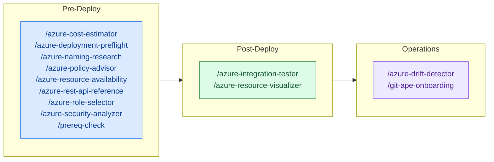

<!-- AUTO-GENERATED — DO NOT EDIT. Source: .github/skills/ -->

# Skills Overview

Skills are focused capabilities invoked by agents at specific stages of the deployment workflow. Each skill handles one task.

> 📇 See the [Skill Registry](./registry) for the full machine-readable catalog (first-party + community) with author and maturity metadata.

## Pre-Deploy Skills

| Skill | Description | Invocable |
|-------|-------------|:---------:|
| [Azure Cost Estimator](./azure-cost-estimator) | Estimate monthly costs for Azure resources by querying the Azure Retail Prices API. Parses ARM templates to identify resources, SKUs, and regions, then looks up real retail pricing. Produces a per-resource cost breakdown with monthly totals. Use during template generation or when user asks about costs. | ✅ |
| [Azure Deployment Preflight](./azure-deployment-preflight) | Run preflight validation on ARM templates before deployment. Performs what-if analysis, permission checks, and generates a structured report with resource changes (create/modify/delete). Use before any deployment to preview changes and catch issues early. | ✅ |
| [Azure Naming Research](./azure-naming-research) | Research Azure naming constraints and CAF abbreviations for a given resource type. Use when you need to look up the official CAF slug, naming rules (length, scope, valid characters), and derive validation/cleaning regex patterns for an Azure resource. Triggers on: CAF abbreviation lookup, Azure naming rules research, resource naming constraints. | ✅ |
| [Azure Policy Advisor](./azure-policy-advisor) | Assess ARM template resources for Azure Policy compliance. Analyse the template, query existing subscription assignments via `az policy assignment list`, identify unassigned built-in and custom policies (CIS, NIST, FedRAMP), and emit a two-part report: template-fixable gaps (Part 1) and subscription-level policy assignments (Part 2). USE FOR: recommending Azure Policy assignments for an ARM template, auditing a subscription against CIS/NIST/general best practices, deciding which initiatives to assign at sub or management-group scope, distinguishing template-fixable vs platform-level governance gaps. DO NOT USE FOR: per-resource security configuration assessment (use azure-security-analyzer), RBAC role recommendations (use azure-role-selector), CAF naming abbreviations (use azure-naming-research), or pricing estimates (use azure-cost-estimator). INVOKES: az policy assignment list, az policy set-definition list, microsoft_docs_search, microsoft_docs_fetch. | ✅ |
| [Azure Resource Availability](./azure-resource-availability) | Query live Azure APIs to validate resource availability before template generation or deployment. Checks VM SKU restrictions, Kubernetes/runtime version support, API version compatibility, and subscription quota. Use during requirements gathering and preflight to catch deployment failures early. | ✅ |
| [Azure Rest Api Reference](./azure-rest-api-reference) | Look up Azure REST API and ARM template reference documentation for any resource type. Returns exact property schemas, required fields, valid values, and latest stable API versions. Use BEFORE generating or modifying ARM templates to ensure correctness. No Azure connection required. | ✅ |
| [Azure Role Selector](./azure-role-selector) | Recommend least-privilege Azure RBAC roles for deployed resources. Finds minimal built-in roles matching desired permissions or creates custom role definitions. Use during security analysis or when configuring access for service principals and managed identities. | ✅ |
| [Azure Security Analyzer](./azure-security-analyzer) | Analyze Azure resource configurations against security best practices using Azure MCP bestpractices service. Produces per-resource security assessment with severity ratings and recommendations. Use during template generation before deployment confirmation. | ✅ |
| [Prereq Check](./prereq-check) | Validate Git-Ape CLI tool installation (az, gh, jq, git), versions, and auth sessions. Shows platform-specific install commands for anything missing. USE FOR: check Git-Ape prerequisites, what do I need to install for Git-Ape, verify Git-Ape CLI tools, az: command not found, gh: command not found, jq: command not found, git: command not found, az missing, gh missing, jq missing, git missing, fresh machine setup for Git-Ape, dev container setup for Git-Ape, before running git-ape-onboarding, az login required, gh auth login, auth expired, not logged in, outdated az version, minimum az version, upgrade az. DO NOT USE FOR: Anything else. This skill is narrowly scoped to prerequisites checks for Git-Ape's CLI tools and auth sessions. Do not use it for any other purpose. | ✅ |

## Post-Deploy Skills

| Skill | Description | Invocable |
|-------|-------------|:---------:|
| [Azure Integration Tester](./azure-integration-tester) | Run post-deployment integration tests for Azure resources. Verify Function Apps, Storage Accounts, Databases, App Services are healthy and accessible. Use after successful Azure deployment. | ✅ |
| [Azure Resource Visualizer](./azure-resource-visualizer) | Analyze deployed Azure resource groups and generate detailed Mermaid architecture diagrams showing relationships between resources. Use for post-deployment visualization, understanding existing infrastructure, or documenting live Azure environments. | ✅ |

## Operations Skills

| Skill | Description | Invocable |
|-------|-------------|:---------:|
| [Azure Drift Detector](./azure-drift-detector) | Detect configuration drift between deployed Azure resources and stored deployment state. Compare actual Azure configuration against desired state in .azure/deployments/, identify differences, and guide user through reconciliation options. Use when checking for manual changes, policy remediations, or unauthorized modifications. | ✅ |
| [Git Ape Onboarding](./git-ape-onboarding) | Bootstrap a GitHub repository for Git-Ape CI/CD: Entra app registration, OIDC federated credentials, RBAC role assignments, GitHub environments (azure-deploy/azure-destroy), required secrets, and scaffold Actions workflow files — plus enterprise-wide distribution via a `.github-private` repo (managed-settings.json plugin standards + custom agents). USE FOR: first-time Git-Ape setup, new subscription onboarding, multi-environment (dev/staging/prod) setup, configure OIDC, federated credentials, RBAC setup, GitHub environments, scaffold workflow files, rolling Git-Ape out org/enterprise-wide. DO NOT USE FOR: deploying resources (use git-ape), drift detection alone, secret rotation. | ✅ |

## General Skills

| Skill | Description | Invocable |
|-------|-------------|:---------:|
| [Azure Stack Deploy](./azure-stack-deploy) | Run an Azure Deployment Stack create (subscription scope) for a prepared Git-Ape deployment artifact and write state.json (schemaVersion 1.0). Use locally so the result matches the CI deploy workflow. | ✅ |
| [Azure Stack Destroy](./azure-stack-destroy) | Tear down a Git-Ape deployment by ID. Reads `state.json` under `.azure/deployments/<id>/` to delete the Azure Deployment Stack and purge soft-deleted Key Vault / Cognitive Services. Refuses to run without `state.json`. Use for any local CLI or VS Code Git-Ape teardown so the result matches the CI destroy workflow. | ✅ |

## Community Skills

Third-party skills contributed under `.github/skills/community/`. These are **not** maintained by the Git-Ape maintainers — see each skill's Author for provenance.

| Skill | Description | Author | Maturity | Invocable |
|-------|-------------|--------|----------|:---------:|
| [Deployment Blueprints](./community/deployment-blueprints) | Provides implementation blueprints and deployment sequencing for Azure SaaS reference topologies. USE FOR: choosing single-region vs multi-region vs deployment-stamp topology, defining deployment sequencing and rollback strategy. DO NOT USE FOR: tenancy model selection itself (use tenant-isolation-models), day-2 scale/SRE operations (use scale-and-sre). | dawright22 | experimental | ✅ |
| [Fulfillment And Metering](./community/fulfillment-and-metering) | Implements Azure Marketplace SaaS fulfillment APIs and metered billing event flows for transactable offers. USE FOR: subscription/entitlement resolution, metering event schema and reconciliation design. DO NOT USE FOR: bootstrapping the accelerator itself (use saas-accelerator-bootstrap), publisher/Partner Center onboarding (use marketplace-onboarding). | dawright22 | experimental | ✅ |
| [Isv Landing Zone Foundation](./community/isv-landing-zone-foundation) | Builds the Azure ISV landing zone baseline for identity, networking, governance, security, and environment separation. USE FOR: standing up the first Azure environment for an ISV SaaS product, defining subscription/management-group layout. DO NOT USE FOR: tenancy model selection (use tenant-isolation-models), marketplace publication (use marketplace-onboarding). | dawright22 | stable | ✅ |
| [Marketplace Offer Types](./community/marketplace-offer-types) | Provides offer-type decision guidance and implementation pathways for Azure Marketplace and related commercial offer models. USE FOR: choosing between SaaS, Azure Application, VM, container, or managed-services offer types. DO NOT USE FOR: executing the onboarding flow itself (use marketplace-onboarding or onboard-to-marketplace). | dawright22 | stable | ✅ |
| [Marketplace Onboarding](./community/marketplace-onboarding) | Guides onboarding to Azure Marketplace: publisher setup, technical configuration, validation, and launch readiness. USE FOR: Partner Center publisher setup, offer metadata/plans/pricing, certification prep. DO NOT USE FOR: choosing the offer type (use marketplace-offer-types), fulfillment API implementation (use fulfillment-and-metering). | dawright22 | stable | ✅ |
| [Multi Tenant Saas](./community/multi-tenant-saas) | Primary orchestration skill for building a multi-tenant Azure SaaS platform, integrating ISV landing zone guidance, SaaS Accelerator patterns, and marketplace publication workflows. USE FOR: starting a new multi-tenant SaaS build, routing work across landing-zone/tenancy/accelerator/marketplace skills. DO NOT USE FOR: single-tenant Azure deployments (use git-ape directly), post-launch operations only (use scale-and-sre). | dawright22 | stable | ✅ |
| [Onboard To Marketplace](./community/onboard-to-marketplace) | End-to-end onboarding flow for Azure Marketplace SaaS publication, from Partner Center readiness to final go-live checks. USE FOR: execution-focused walk-through of the full onboarding flow for a SaaS offer specifically. DO NOT USE FOR: comparing offer types (use marketplace-offer-types), general multi-offer-type onboarding (use marketplace-onboarding). | dawright22 | experimental | ✅ |
| [Saas Accelerator Bootstrap](./community/saas-accelerator-bootstrap) | Bootstraps and customizes the Azure Commercial Marketplace SaaS Accelerator as a starting point for transactable SaaS offers. USE FOR: standing up fulfillment/billing scaffolding quickly using the official accelerator, deciding what to customize vs. keep as-is. DO NOT USE FOR: building fulfillment APIs from scratch (use fulfillment-and-metering), tenancy model decisions (use tenant-isolation-models). | dawright22 | experimental | ✅ |
| [Scale And Sre](./community/scale-and-sre) | Implements production scale, reliability, and observability patterns for multi-tenant SaaS platforms. USE FOR: SLO/alerting design, capacity/tenant-placement planning, DR, tenant-aware telemetry and cost attribution. DO NOT USE FOR: initial tenancy model selection (use tenant-isolation-models), lifecycle automation (use tenant-lifecycle-automation). | dawright22 | stable | ✅ |
| [Security And Compliance](./community/security-and-compliance) | Defines security architecture and compliance controls for multi-tenant SaaS, including identity, secrets, data protection, and auditability. USE FOR: cross-tenant isolation threat modeling, compliance control mapping, secret/key lifecycle design. DO NOT USE FOR: tenancy model selection itself (use tenant-isolation-models), landing zone governance baseline (use isv-landing-zone-foundation). | dawright22 | stable | ✅ |
| [Tenant Isolation Models](./community/tenant-isolation-models) | Designs and validates tenancy models (shared, pooled, siloed, hybrid) with security, cost, and scale trade-offs. USE FOR: choosing an isolation model per architecture layer (compute/data/identity/messaging/networking), compliance-driven isolation decisions. DO NOT USE FOR: landing zone setup (use isv-landing-zone-foundation), lifecycle automation (use tenant-lifecycle-automation). | dawright22 | stable | ✅ |
| [Tenant Lifecycle Automation](./community/tenant-lifecycle-automation) | Implements automated tenant onboarding, provisioning, upgrade, suspension, and offboarding workflows. USE FOR: designing idempotent tenant state machines, reconciliation of partial/drifted tenant state. DO NOT USE FOR: initial tenancy model selection (use tenant-isolation-models), marketplace fulfillment events specifically (use fulfillment-and-metering). | dawright22 | experimental | ✅ |

## Skill Invocation in Deployment Flow

