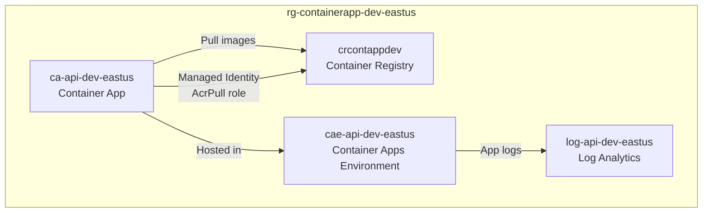

# Deploy Container Apps

> **TL;DR** — Deploy a containerized application on Azure Container Apps with registry, logging, and auto-scaling configured automatically.

## Architecture



## Conversation

```
@git-ape deploy a Container App with Registry and Log Analytics
         for the payments-api project in dev, eastus
```

## Key Configuration

| Resource | Settings |
|----------|----------|
| Container App | Min replicas: 0, Max: 10, CPU: 0.5, Memory: 1Gi |
| Container Apps Environment | Connected to Log Analytics workspace |
| Container Registry | Basic SKU, admin user disabled, managed identity pull |
| Log Analytics | 30-day retention |

## Scaling Rules

Container Apps auto-scales based on HTTP traffic:

```json
{
  "scale": {
    "minReplicas": 0,
    "maxReplicas": 10,
    "rules": [
      {
        "name": "http-scaling",
        "http": { "metadata": { "concurrentRequests": "50" } }
      }
    ]
  }
}
```

## Related

- [Deploy Function App](/docs/use-cases/deploy-function-app)
- [CI/CD Pipeline](/docs/use-cases/cicd-pipeline)
- [Cost Estimation](/docs/use-cases/cost-estimation)
