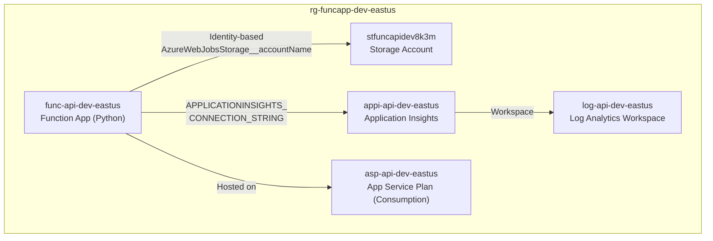

# Deploy a Function App

> **TL;DR** — Tell `@git-ape` to deploy a Function App. It generates an ARM template with managed identity, storage, App Insights, and deploys with full security analysis.

## Architecture



## Conversation Walkthrough

### Start the Deployment

```
@git-ape deploy a Python Function App with Storage and App Insights
         for the order-api project in dev, region eastus
```

### What Git-Ape Does

1. **Requirements Gatherer** validates your inputs:
   - Project name: `order-api` → valid characters, reasonable length
   - Environment: `dev` → recognized tag
   - Region: `eastus` → available for all resource types

2. **Naming Research** generates CAF-compliant names:
   - Function App: `func-orderapi-dev-eastus`
   - Storage: `storderapidev` + `uniqueString()`
   - App Insights: `appi-orderapi-dev-eastus`

3. **Template Generator** creates the ARM template with:
   - Managed identity (`AzureWebJobsStorage__accountName`)
   - HTTPS-only, TLS 1.2
   - FTP disabled
   - Shared key access disabled on storage
   - RBAC: Storage Blob Data Contributor for the Function App's managed identity

4. **Security Analyzer** runs the blocking gate:

   ```
   🔒 Security Gate: PASSED ✅
   ├── ✅ Managed identity enabled
   ├── ✅ HTTPS-only enforced
   ├── ✅ TLS 1.2 minimum
   ├── ✅ FTP disabled
   ├── ✅ Shared key access disabled
   └── ✅ RBAC role assignments included
   ```

5. **Cost Estimator** shows the breakdown:

   | Resource | SKU | Estimated Cost |
   |----------|-----|---------------|
   | Function App | Consumption (Y1) | $0.00 (free tier) |
   | Storage Account | Standard LRS | $2.40/mo |
   | App Insights | Pay-as-you-go | $2.30/mo |
   | Log Analytics | Pay-as-you-go | $2.76/mo |
   | **Total** | | **$7.46/mo** |

6. **You approve** → deployment executes → integration tests verify health

## Key Security Features

- **No connection strings** — uses `AzureWebJobsStorage__accountName` (identity-based)
- **`allowSharedKeyAccess: false`** — storage only accepts managed identity auth
- **`ftpsState: Disabled`** — no FTP access to the Function App
- **`httpsOnly: true`** — all traffic encrypted
- **`minTlsVersion: '1.2'`** — no legacy TLS

## Related

- [Skills: Azure Cost Estimator](/docs/skills/azure-cost-estimator)
- [Skills: Azure Security Analyzer](/docs/skills/azure-security-analyzer)
- [Skills: Azure Naming Research](/docs/skills/azure-naming-research)
- [For Engineers: Quick Start](/docs/personas/for-engineers)
