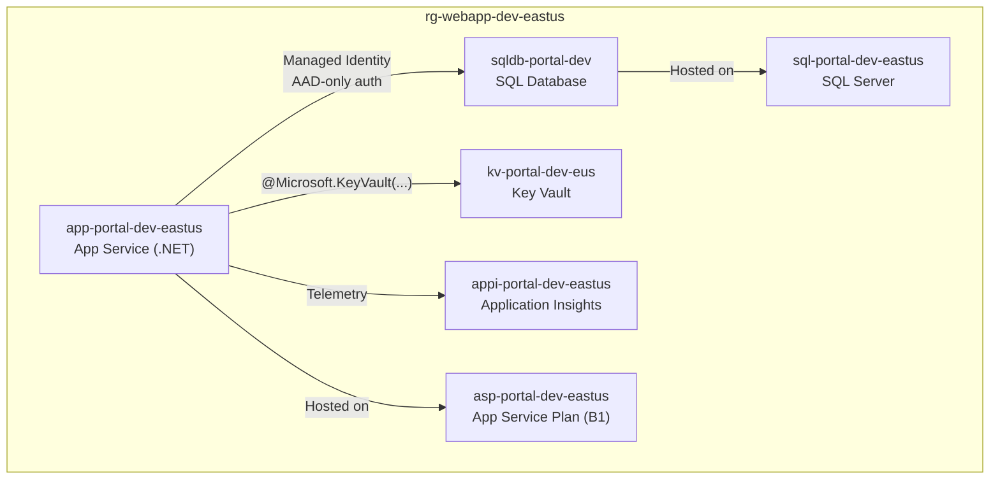

# Deploy Web App + SQL Database

> **TL;DR** — Deploy a full-stack web application with Azure SQL, Key Vault for secrets, and managed identities for secure resource communication.

## Architecture



## Conversation

```
@git-ape deploy a .NET web app with SQL Database and Key Vault
         for the customer-portal project in dev, eastus
```

## Resource Configuration

| Resource | Key Settings |
|----------|-------------|
| App Service | HTTPS-only, TLS 1.2, managed identity enabled, FTP disabled |
| SQL Server | AAD-only auth (`azureADOnlyAuthentication: true`), no SQL auth |
| SQL Database | Standard S1, geo-backup enabled |
| Key Vault | RBAC authorization, soft-delete enabled, purge protection |
| App Insights | Connected via instrumentation key in Key Vault |

## Security Highlights

- **AAD-only SQL authentication** — no SQL username/password
- **Key Vault references** — app settings use `@Microsoft.KeyVault(SecretUri=...)` syntax
- **Managed identity chain** — App Service → SQL Database, App Service → Key Vault
- **RBAC roles auto-assigned**:
  - App Service → `SQL DB Contributor` on SQL Database
  - App Service → `Key Vault Secrets User` on Key Vault

## Related

- [Security Analysis Walkthrough](/docs/use-cases/security-analysis)
- [Cost Estimation](/docs/use-cases/cost-estimation)
- [For Engineers](/docs/personas/for-engineers)
