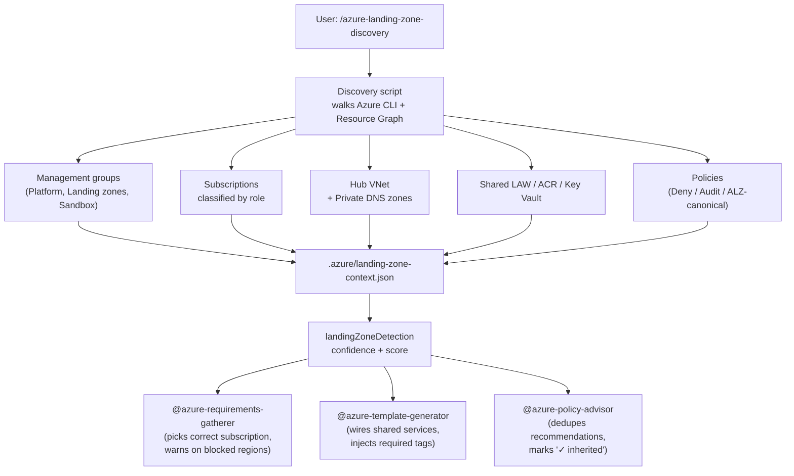

# Landing Zone-Aware Deployment

> **TL;DR** — Run `/azure-landing-zone-discovery` once. Git-Ape reads `.azure/landing-zone-context.json` from every later stage and tailors deployments to your tenant's management groups, hub VNet, shared Log Analytics/ACR, allowed regions, required tags, and Deny-effect policies.

## Why It Matters

Enterprise Azure tenants follow the [Cloud Adoption Framework landing zone architecture](https://learn.microsoft.com/azure/cloud-adoption-framework/ready/landing-zone/) — workloads land in application subscriptions, peer to a connectivity hub VNet, ship diagnostics to a central Log Analytics workspace, pull container images from a shared ACR, and obey policies enforced at the management group level.

Without landing zone awareness, Git-Ape would:

- Recommend regions blocked by `Allowed-Locations`
- Create standalone Log Analytics workspaces alongside the central one
- Provision a fresh ACR per deployment
- Generate public IPs that get denied at deploy time
- Re-recommend policies the tenant already enforces

Landing zone discovery fixes all of that.

## How It Works



## Run It

### Auto-discovery (default)

```text
/azure-landing-zone-discovery
```

The skill calls `az account management-group list`, `az policy assignment list`, Azure Resource Graph for shared services, and writes the result to `.azure/landing-zone-context.json`.

### Inspect what was discovered

```bash
jq '.landingZoneDetection | {isLandingZone, confidence, confidenceScore}' \
  .azure/landing-zone-context.json
```

```json
{
  "isLandingZone": true,
  "confidence": "high",
  "confidenceScore": 85
}
```

See [Landing Zone Context](/docs/deployment/landing-zone-context) for the full schema.

### Manual injection (cross-tenant / limited RBAC)

When discovery cannot reach management groups (CSP, MCA, air-gapped tenants), inject context manually:

```bash
.github/skills/azure-landing-zone-discovery/scripts/inject-lz.sh \
  --hub-vnet-id "/subscriptions/.../virtualNetworks/vnet-hub" \
  --log-analytics-id "/subscriptions/.../workspaces/log-central" \
  --acr-id "/subscriptions/.../registries/crshared" \
  --allowed-locations "eastus,westus2" \
  --required-tags "Environment,Project,CostCenter"
```

## Confidence Buckets

Discovery scores every tenant against the canonical [ALZ accelerator](https://azure.github.io/Azure-Landing-Zones/accelerator/) reference. Each consumer gates its behavior on the bucket.

| Confidence | Score | Git-Ape behavior |
|---|---:|---|
| **`high`** | ≥ 70 | Auto-apply context. Pick correct subscription, peer to hub, wire shared services, inject required tags. No prompts. |
| **`medium`** | 40–69 | Surface matched + missing signals; ask user to confirm before treating tenant as ALZ-managed. |
| **`low`** | 10–39 | Treat as standalone tenant. Use only `allowedLocations` / `requiredTags` if explicitly set. |
| **`none`** | < 10 | No ALZ signature. Default to flat-tenant assumptions. Recommend manual injection only if the user knows the tenant *is* ALZ-managed. |

## How Each Stage Uses It

| Stage | Consumer | What it reads | What changes |
|---|---|---|---|
| **0. Pre-flight** | `@git-ape` orchestrator | `landingZoneDetection`, `discoveredAt` | Surfaces confidence, warns on stale context (>7 days), propagates path to subagents |
| **1. Requirements** | `@azure-requirements-gatherer` | `subscriptions.landingZones[]`, `policies.allowedLocations[]` | Routes `dev`/`prod` to correct subscription, blocks deny-listed regions early |
| **2. Templates** | `@azure-template-generator` | `sharedServices.*`, `networking.hubs[]`, `policies.requiredTags[]` | Wires diagnostics to shared LAW, references shared ACR, generates hub peering, injects required tags |
| **2.5. Security** | Security gate | `policies.denyEffects[]` | Cross-checks template against deny-effect policies before deployment |
| **Policy review** | `@azure-policy-advisor` | `policies.alzCanonicalAssignments[]`, `denyEffects[]`, `auditEffects[]` | Marks already-enforced policies as "✓ inherited"; doesn't re-recommend them |

## Walkthrough

```text
You: /azure-landing-zone-discovery

🔍 Discovering landing zone topology...
  ✓ Management groups: 4 top-level (Platform, Landing zones, Sandbox, Decommissioned)
  ✓ Platform children: Connectivity, Identity, Management
  ✓ Subscriptions classified: 3 platform / 5 landing zones
  ✓ Hub VNet: vnet-hub-eastus (sub-connectivity-prod)
  ✓ Shared services: log-platform-prod-eastus, crplatformprod
  ✓ Policies: 2 Deny, 1 Audit, 2 ALZ-canonical assignments

✅ Confidence: high (score 85)
   Reference: https://azure.github.io/Azure-Landing-Zones/accelerator/

Saved → .azure/landing-zone-context.json
Commit this file so the team shares the same topology view.
```

Now run a deployment:

```text
You: @git-ape deploy a Python function app

🛫 Stage 0: Landing Zone Context
  ✓ Context found (confidence: high, age: 1 day)
  → Auto-apply mode

🛫 Stage 1: Requirements
  ✓ Target subscription: sub-app-dev (auto-selected, environment=dev)
  ⚠ Region "centralus" not in allowedLocations [eastus, westus2, westeurope]
  → Defaulting to eastus
  ✓ Required tags injected: Environment, Project, CostCenter

🛫 Stage 2: Templates
  ✓ Diagnostics → log-platform-prod-eastus (shared)
  ✓ Container Apps env peered to vnet-hub-eastus
  ✓ Private endpoint linked to privatelink.azurewebsites.net
  ⚠ Deny-Public-IP policy active — using private endpoint instead

🛫 Stage 2.5: Security Gate
  ✓ Template compliant with 2 deny-effect policies

🛫 Stage 3: Deploy
  ✓ Deployment succeeded
```

## When to Refresh

Re-run `/azure-landing-zone-discovery` when:

- The context is older than 7 days (Git-Ape warns automatically)
- A new shared service was provisioned (e.g., new central Log Analytics)
- A new management group policy was assigned
- A new application landing zone subscription was created
- You switched tenants or rotated credentials

## Commit or Ignore?

| Confidence | Recommendation |
|---|---|
| `high` / `medium` | **Commit** `.azure/landing-zone-context.json` so the team shares one topology view |
| `low` / `none` | Decide per team — the file is mostly empty; manual injection results should usually be committed |
| Personal sandbox | Ignore — add to `.gitignore` to avoid leaking tenant identifiers in shared repos |

## Related

- [Skills: Azure Landing Zone Discovery](/docs/skills/azure-landing-zone-discovery) — full procedure and CLI reference
- [Deployment: Landing Zone Context](/docs/deployment/landing-zone-context) — schema and field-level reference
- [Policy Compliance](/docs/use-cases/policy-compliance) — how policy recommendations dedupe against the tenant
- [Onboarding](/docs/getting-started/onboarding) — discovery runs as step 10 of the onboarding playbook
- [For Platform Engineering](/docs/personas/for-platform-engineering) — guardrails and policy enforcement
