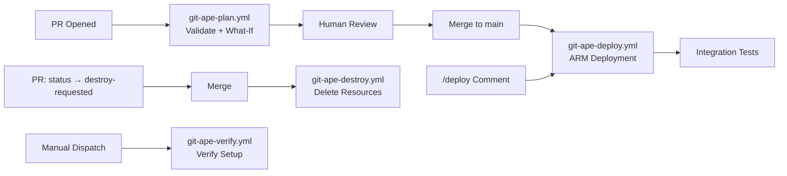

<!-- AUTO-GENERATED — DO NOT EDIT. Source: .github/workflows/ -->

---
title: "CI/CD Workflows Overview"
sidebar_label: "Overview"
sidebar_position: 1
description: "Overview of Git-Ape GitHub Actions workflows"
---

# CI/CD Workflows Overview

Git-Ape provides GitHub Actions workflows for automated deployment lifecycle management.

## Workflow Inventory

| Workflow | File | Triggers | Jobs |
|----------|------|----------|------|
| [Git-Ape: Docs Check](./git-ape-docs-check) | `git-ape-docs-check.yml` | pull_request | check-docs |
| [Git-Ape: Docs Deploy](./git-ape-docs) | `git-ape-docs.yml` | push | build, deploy |

## Pipeline Architecture

