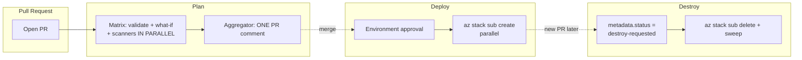

# CI/CD Workflows Overview

Git-Ape ships **four** workflows (plan → deploy → destroy + verify) on **two** providers (GitHub Actions, Azure DevOps Pipelines). Both providers share the same triggers, security model, `state.json` schema, and parallelism patterns.

## The four workflows

| Workflow | When | What |
|---|---|---|
| **plan** | PR opened/updated | Validate, what-if, IaC scans, **one consolidated PR comment** with summary table + per-deployment detail |
| **deploy** | Merge to `main` (or `/deploy` PR comment, GitHub only) | `az stack sub create` (parallel), integration tests, commit `state.json` |
| **destroy** | Merge to `main` after `metadata.json.status = destroy-requested` | `az stack sub delete --action-on-unmanage deleteAll` + soft-delete sweep |
| **verify** | Manual | OIDC + RBAC + cross-host tooling check |

Files live under:

| Provider | Path |
|---|---|
| GitHub Actions | `.github/workflows/git-ape-{plan,deploy,destroy,verify}.yml` |
| Azure DevOps | `.azure-pipelines/git-ape-{plan,deploy,destroy,verify}.yml` |

## Lifecycle



## Provider parity

| Concern | GitHub Actions | Azure DevOps Pipelines |
|---|---|---|
| Trigger | Native `on: pull_request` | Branch Policy → Build Validation (YAML `pr:` is silently ignored) |
| Approval | Environment + optional `/deploy` comment | Environment pre-deployment approval |
| OIDC | `azure/login@v2` | `AzureCLI@2` with workload identity federation |
| Matrix | `strategy.matrix` over JSON list | `strategy.matrix: $[ <runtime expr> ]` over object |
| PR comment | `gh api` | `curl` to threads API |
| State commit-back | `GITHUB_TOKEN` (`contents: write`) | Build identity (needs ACL `allow=16516`) |

## Shared scripts

The PR-comment renderer, summary-JSON renderer, and destroy-plan renderer are bash scripts called by both providers:

```
.azure-pipelines/scripts/    ← shared
├── render-pr-comment.sh
├── render-summary.sh
└── render-destroy-plan.sh
```

Same input args, same stdout shape, no provider-specific logic in the renderers.

## What changed recently

| Before | After |
|---|---|
| `az deployment sub create` | `az stack sub create` ([Deployment Stacks](../reference/deployment-stacks)) |
| Sequential per-deployment loops | Parallel (matrix + bash `& wait`) |
| One PR comment per deployment | ONE consolidated comment with summary table + collapsibles |
| `az group delete` for destroy | `az stack sub delete --action-on-unmanage deleteAll` + soft-delete sweep |
| `state.json` had `resourceGroup` only | Adds `stackId`, `managedResources[]`, `purgedResources[]`, `retainedSoftDeleted[]` |

## Where next

- Per-pipeline anatomy: [`reference/pipeline-architecture`](../reference/pipeline-architecture) — provider-agnostic overview, links to ADO + GH deep dives
- Deploy primitive: [`reference/deployment-stacks`](../reference/deployment-stacks)
- State file schema: [`deployment/state`](../deployment/state)
- Failure modes + fixes: [`reference/troubleshooting`](../reference/troubleshooting)
